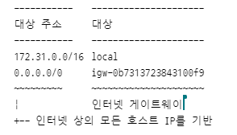

# VPC(Virtual Private Cloud)

- AWS 사용자 계정 전용 가상 네트워크
- AWS 클라우드에서 다른 가상 네트워크와 논리적으로 분리
- 한 AWS 리안 안에서만 존재할 수 있고, 한 리전에 만든 VPC는 다른 리전에서는 보이지 않음 ⇒ VPC Peering를 이용하여 접근할 수 있음
- 생성 시 RFC 1918에 지정된 프라이빗 주소 체계 사용을 권장
    - 10.0.0.0/8 ⇒ 10.0.0.0. - 10.255.255.255
    - 172.16.0.0/12 ⇒ 172.16.0.0 - 172.31.255.255
    - 192.168.0.0/16 ⇒ 192.168.0.0 - 192.168.255.255

## VPC 구성 옵션

https://docs.aws.amazon.com/ko_kr/vpc/latest/userguide/create-vpc.html

## 기본 VPC (default VPC)

https://docs.aws.amazon.com/ko_kr/vpc/latest/userguide/default-vpc.html

<aside>
💡 Amazon VPC를 사용하기 시작하는 경우 각 AWS 리전에 기본 VPC가 있습니다. 기본 VPC는 각 가용 영역의 퍼블릭 서브넷, 인터넷 게이트웨이 및 DNS 확인 활성화 설정과 함께 제공됩니다. 따라서 기본 VPC로 Amazon EC2 인스턴스를 즉시 시작할 수 있습니다. 기본 VPC에서 Elastic Load Balancing, Amazon RDS, Amazon EMR 같은 서비스를 사용할 수도 있습니다.

</aside>

- 대부분 설정에서 허용이 되어 있기 때문에 보안에 약하다.

### **기본 VPC 구성 요소**

- IPv4 CIDR 블록의 크기가 /16인 VPC를 만든다`172.31.0.0/16).` 이는 최대 65,536개의 프라이빗 IPv4 주소를 제공한다.
- 각 가용 영역에 크기 ****`/20의 기본 서브넷을 생성`한다. 이렇게 하면 서브넷당 최대 4,096개의 주소가 제공되며, 그중 몇 개는 내부용으로 예약되어 있다.
- `인터넷 게이트웨이`를 만들어 기본 VPC에 연결한다.
- 기본 라우팅 테이블에 `모든 트래픽(0.0.0.0/0)이 인터넷 게이트웨이로 전달되는 경로를 추가`한다.
- `기본 보안 그룹(방화벽 - ssh 접속)`을 만들어 기본 VPC와 연결한다.
- AWS 계정에서 설정된 `기본 DHCP 옵션을` 기본 VPC와 연결한다.

### 서브넷(subnet)

- VPC 내 논리적으로 구분하는 것
- 인스턴스는 서브넷 안에 위치 ⇒ EC2 인스턴스를 배치하는 장소
    - 한 번 서브넷에 인스턴스를 생성하면 다른 서브넷으로 옮길 수 없다.
    - 옮기고 싶다면 인스턴스를 종료하고 다른 서브넷에 새 인스턴스를 만들어야 한다.
- 인스턴스를 서로 격리하고, 인스턴스 간의 트래픽 흐름을 제어하고, 인스턴스를 기능 별로 묶을 수 있다. → 쿠버네트서에서의 네임스페이스를 생각하면 된다.
- 서브넷은 하나의 가용 영역(AZ, Availability Zone)내에서만 존재할 수 있다.
- 서브넷 CIDR 블록
    - VPC의 일부, VPC내에서는 유니크해야 한다.
    - 모든 서브넷에서 처음 4개의 IP와 마지막 한개의 IP는 예약되어 있으므로 인스턴스에 할당할 수 없다.
        - 예) 서브넷 CIDR이 172.16.100.0/24인 경우 아래 IP는 사용 불가
        
        | 172.16.100.0 | 네트워크 주소 |
        | --- | --- |
        | 172.16.100.1 | AWS에서 VPC라우터용으로 예약 |
        | 172.16.100.2 | DNS 서버 주소 |
        | 172.16.100.3 | AWS에서 나중에 사용하려고 예약 |
        | 172.15.100.255 | 네트워크 브로드캐스트 주소 |
- 퍼블릿 서브넷
    - 서브넷이 인터넷 게이트웨이로 향하는 라우팅이 있는 라우팅 테이블과 연결된 경우
- 프라이빗 서브넷
    - 서브넷이 인터넷 게이트웨이로 향하는 라우팅이 없는 라우팅 테이블과 연결된 경우
    

### ENI(Elastic Network Interface, 탄력적 네트워크 인터페이스)

- 물리 서버의 네트워크 인터페이스와 같은 기능을 수행
- VPC에서 가상 네트워크 카드를 나타내는 논리적 네트워크 구성 요소

### 인터넷 게이트웨이(igw)

- 퍼블릭 IP주소를 갖는 인스턴스가 인터넷에 연결할 수 있도록 기능을 제공
- 처음 VPC를 만들면 인터넷 게이트웨이가 연결되어 있지 않으므로, 직접 인터넷 게이트웨이를 만들고 VPC와 연결해야 한다.
- 하나의 VPC는 하나의 IGW만 연결할 수 있다.

### 라우팅(routing)

- VPC의 `네트워크 트래픽을 전달할 위치를 결정`하는데 사용되는 규칙
- 트래픽을 전달할 IP주소 범위(대상 주소)와 `트래픽을 전송할 게이트웨이, 네트워크 인터페이스 또는 연결(대상)`을 지정
- VPC는 소프트웨어 함수로 IP 라우팅을 구현 → 사용자는 라우팅 테이블만 관리
- 라우팅 테이블 ⇒ 라우팅 집합으로, 서브넷과 연결할 수 있다.
- 기본 라우팅 테이블 ⇒ VPC와 함께 자동으로 제공되는 라우팅 테이블
    - 기본 VPC인 경우, local 및 igw로의 라우팅을 포함
    - 기본 VPC가 아닌 경우, local 라우팅만 포함

    
    ⇒ 172.31.10.10으로 패킷을 보내려고 하면, local로 라우팅된다.

    ⇒ 198.51.100.50으로 패킷을 보내려고 하면, 라우팅할 위치와 가장 근접하게 일치하는 항목을 기반으로 라우팅 처리를 한다. (192~이 없기 때문에 IGW로 라우팅된다.)

    ⇒ `라우팅 테이블의 항목들간의 순서는 중요하지 않다.`

### 보안 그룹(security group)

- 방화벽과 같은 기능을 제공
- 인스턴스의 ENI에서 송수신하는 트래픽을 제어
- 모든 ENI는 최소 한 개 이상의 보안 그룹과 연결되어야 하고, 보안 그룹은 여러 ENI와 연결될 수 있다.
- 생성할 때 보안 그룹 이름, 설명, 포함될 VPC를 지정하고, 생성 후에 인바운드, 아웃바운드 규칙을 지정 ⇒ 트래픽을 허용
- **상태 저장 방화벽 역할** ⇒ 보안 그룹이 트래픽을 한 방향으로 전달하도록 허용할 때, 반대 방향의 응답 트래픽을 지능적으로 허용한다.
    
    (들어올 때의 소스 포트를 기억하고 있다가 나갈 때 해당 포트로 나갈 수 있도록 한다)
    

### NACL(Network Access Control List)

https://docs.aws.amazon.com/ko_kr/vpc/latest/userguide/vpc-network-acls.html#default-network-acl

- 보안 그룹과 유사 → 방화벽처럼 동작한다.
    - 원본 또는 대상 주소 CIDR, 프로토콜, 포트를 기반으로 트래픽을 인바운드, 아웃바운드 규칙으로 제어 ⇒ 방화벽과 같은 역할을 수행
    - VPC에는 삭제할 수 없는 기본 NACL이 있다.
- 서브넷에 연결되어 해당 서브넷과 송수신되는 트래픽을 제어
- `상태 비저장`
    - NACL을 통과한 연결 상태를 추적하지 않는다.
    - 모든 임바운드와 아웃바운드 트래픽의 허용 규칙을 별도로 작성해야한다.
- `규칙을 적용할 때 규칙 번호의 오름차순으로 처리`

### 보안 그룹과 NACL비교

| 보안 그룹 | 네트워크 ACL |
| --- | --- |
| 인스턴스 레벨에서 운영 | 서브넷 레벨에서 운영 |
| 인스턴스와 연결된 경우에만 인스턴스에 적용 | 연결된 서브넷에서 배포된 모든 인스턴스에 적용
(보안 그룹 규칙이 지나치게 허용적일 경우 추가 보안 계층 제공) |
| 허용 규칙만 지원 | 허용 및 거부 규칙 지원 |
| 트래픽 허용 여부를 결정하기 전에 모든 규칙을 평가 | 트래픽 허용 여부를 결정할 때 가장 낮은 번호의 규칙부터 순서대로 규칙을 평가 |
| 상태 저장 : 규칙에 관계없이 반환 트래픽이 허용된다. | 상태 비저장 : 반환 트래픽이 규칙에 따라 명시적으로 허용되어야 한다. |

## EC2

https://aws.amazon.com/ko/pm/ec2/

- 안전하고 크기 조정이 가능한 컴퓨팅 파워를 클라우드에서 제공하는 웹 서비스
- 안정적인 확장 가능한 인프라에 온디맨드로 액세스
- 99.99%의 가용성을 지원한 SLA 약정을 기반을 몇 분 안에 용량 크기를 조정

### AMI(Amazon Machine Image)

- 인스턴스를 시작하는데 필요한 정보를 제공하는 AWS에서 지원되고 유지 관리 되는 이미지

**인스턴스 타입 명명 규칙**

https://docs.aws.amazon.com/ko_kr/AWSEC2/latest/UserGuide/instance-types.html

**인스턴스 타입**

https://aws.amazon.com/ko/ec2/instance-types

### EBS(Elastic Block Store)

- EBS는 EC2를 위해 설계된 사용이 쉽고 확장 가능한 고성능 블록 스토리지 서비스
- EBS 볼륨은 특정 가용 영역에 위치하며 여기에서 자동으로 복제되므로, 단일 구성 요소에 장애가 발생하더라도 안정하게 보호된다.
- 모든 EBS 볼륨 유형은 안정적인 스냅샷 기능을 제공하며, 높은 가용성을 제공하도록 설계

### EBS 스냅샷

- EBS 스냅샷은 데이터의 특정 시점 복사본이며, 재해 복구를 지원하고 리전 및 계정 간에 데이터를 마이그레이션하며 백업 규정 순수를 개선하는데 사용

### EIP(Elastic IP, 탄력적 IP)

- 정적 IPv4주소로, AWS 계정에 할당되며 릴리스할 때까지 할당된 상태를 유지
- EC2 인스턴스를 중지하고 다시 시작하면 퍼블릭 IP주소가 변경되나, EC2 인스턴스에 EIP주소를 연결하면 EC2인스턴스를 다시 시작해도 동일한 IP주소로 접속이 가능
- `EIP 주소 요금`
    - 인스턴스가 실행 중인 동안에는 이와 연결된 EIP주소 하나에 대해서는 요금이 부과되지 않지만 해당 인스턴스와 연결된 추가 EIP주소에 대해서는 요금이 부과
    - `연결되지 있지 않거나 중지된 인스턴스 또는 연결되지 않은 네트워크 인터페이스와 연결된 경우  시간당 요금이 부과`
    - 2024년 2월 1일부터, 실행 중인 인스턴스와 연결된 주소를 포함하여 모든 EIP주소에 대해 요금이 부과

### ELB(Elastic Load Balancing)

### Amazon EC2 Auto Scaling

## Amazon SNS (Simple Notification Service)

https://docs.aws.amazon.com/ko_kr/sns/latest/dg/welcome.html

애플리케이션 간 혹은 애플리케이션과 사용자 간 통신을 위한 완전 관리형 메세징 서비스

