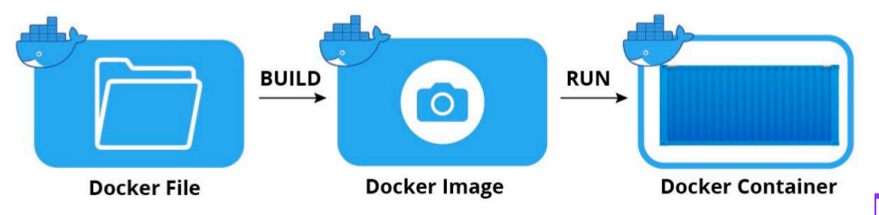
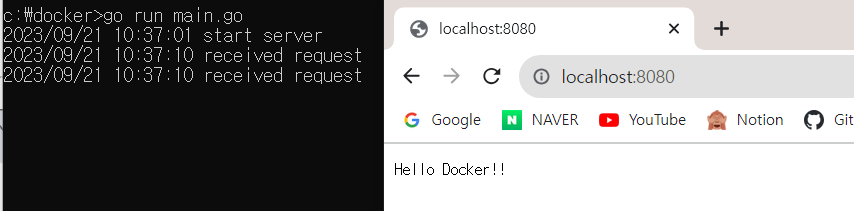
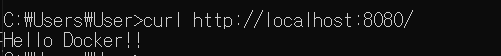
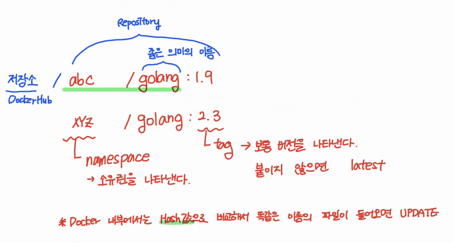
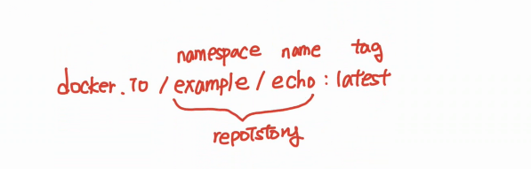
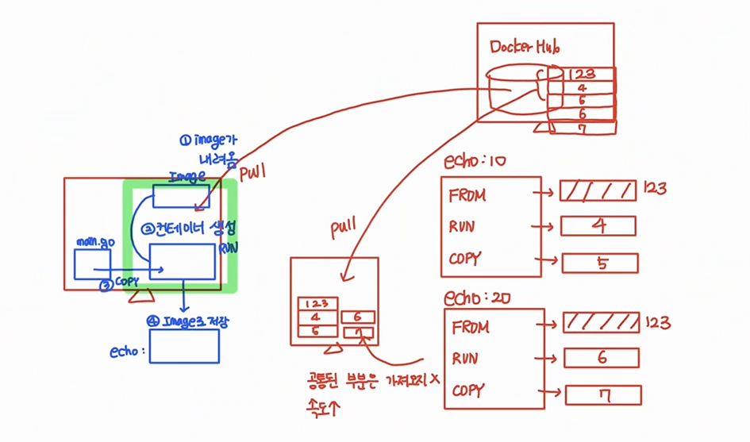
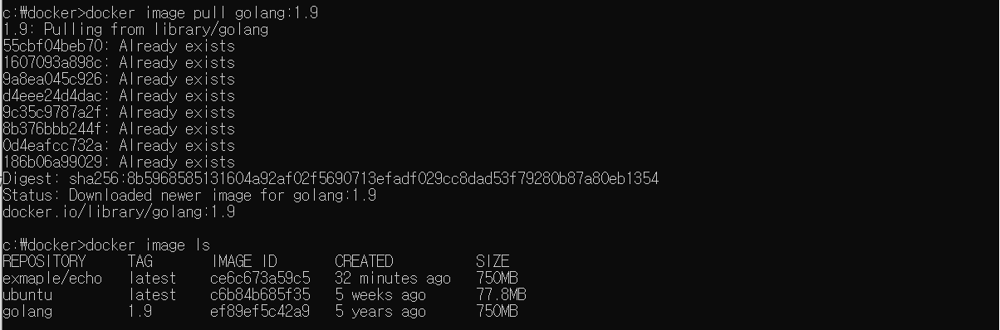
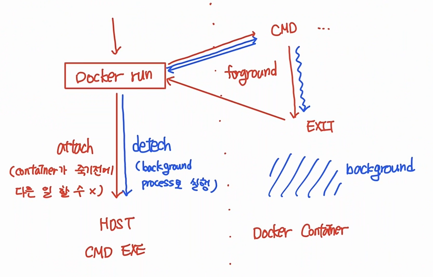

# docker_02

생성일: 2023년 9월 20일 오전 9:05

### Dockerfile을 이용한 도커 이미지 빌드



**Dokerfile [Link](https://docs.docker.com/engine/reference/builder/)**

도커 이미지를 빌드하는데 필요한 모든 명령어를 순서대로 기술한 텍스트 파일

**docker image build = docker build**

- Dockerfile 및 컨텍스트(context)에서 Docker 이미지를 빌드할 때 사용하는 명령어
    - Dockerfile
        - 컨테이너에 설치해야 하는 패키지(FROM), 추가해야하는 소스 코드(ADD, COPY), 실행해야 하는 명령어와 쉘 스크립트(RUN, CMD) 등을 기록한 파일
    - 컨텍스트(context)
        - 지정된 경로(PATH) 또는 URL에 있는 파일 세트
        - build 프로세스는 컨텍스트에 있는 모든 파일을 참조할 수 있다.
- Dockerfile을 사용하면 직접 컨테이너를 생성하고 이미지로 커밋해야 하는 번거로움을 덜 수 있을 뿐 아니라 깃과 같은 개발 도구를 통해 이플리케이션의 `빌드 및 배포를 자동화`할 수 있다.

- 실습1
    
    **작업 디렉터리 생성, main.go 파일 작성**
    
    ```bash
    cd /
    mkdir docker
    cd docker
    code .
    ```
    
    vscode의 main.go
    
    ```go
    package main
    
    import (
    	"fmt"
    	"log"
    	"net/http"
    )
    
    func main() {
    	http.HandleFunc("/", func(w http.ResponseWriter, r *http.Request) {
    		log.Println("received request")
    		fmt.Fprintf(w, "Hello Docker!!")
    	})
    
    	log.Println("start server")
    	server := &http.Server{Addr: ":8080"}
    	if err := server.ListenAndServe(); err != nil {
    		log.Println(err)
    	}
    }
    ```
    
    8080 포트로 HTTP 요청을 대기하다가, /로 요청이ㅣ 들어오면 Hello Docker!!!를 응답으로 반환하는 프로그램
    
    **개발환경(PC)에서 main.go를 실행**
    
    - [go를 다운로드해서 설치](https://go.dev/dl/)
    - 명령 프롬프트를 새로 실행한 후 작업 디렉터리로 이동해서 main.go를 실행
    
    ```bash
    cd c:/docker
    go run main.go
    ```
    
    - [http://localhost:8080/](http://localhost:8080/) 으로 접속
    
    
    
    ```bash
    curl http://localhost:8080
    ```
    
   
    
    - Dockerfile 작성
    
    vscode c:/docker/Dockerfile
    
    ```docker
    FROM  golang:1.9
    RUN   mkdir /echo
    COPY  main.go /echo
    CMD   ["go", "run", "/echo/main.go"]
    ```
    
    - FROM
        - 베이스 이미지 지정
        - 저장소 이름을 명시하지 않으면 Docker Hub 공식이미지
    - RUN
        - 컨테이너 내부에서 실행한 명령어를 지정
    - COPY
        - 호스트의 main.go 파일을 컨테이너의 /echo/main.go로 복사
    - CMD
        - 컨테이너 실행 시 실행할 명령어 → go run /echo/main.go
    
   
    
    - 도커 이미지 빌드 및 확인
    
    ```bash
    docker image build --help
    
    Options :
    -f, --file string                   Name of the Dockerfile (default:
                                          "PATH/Dockerfile")
    --no-cache                      Do not use cache when building the image
    --pull                          Always attempt to pull all referenced images
    -t, --tag stringArray               Name and optionally a tag (format:
                                          "name:tag")
    ```
    
    ```bash
    docker image build -t exmaple/echo:latest .
    
    [+] Building 24.0s (8/8) FINISHED                                                                        docker:default
     => [internal] load .dockerignore                                                                                  0.0s
     => => transferring context: 2B                                                                                    0.0s
     => [internal] load build definition from Dockerfile                                                               0.0s
     => => transferring dockerfile: 518B                                                                               0.0s
     => [internal] load metadata for docker.io/library/golang:1.9                                                      3.2s
     => [1/3] FROM docker.io/library/golang:1.9@sha256:8b5968585131604a92af02f5690713efadf029cc8dad53f79280b87a80eb1  19.4s
     => => resolve docker.io/library/golang:1.9@sha256:8b5968585131604a92af02f5690713efadf029cc8dad53f79280b87a80eb13  0.0s
     => => sha256:9a8ea045c9261c180a34df19cfc9bb3c3f28f29b279bf964ee801536e8244f2f 4.34MB / 4.34MB                     1.0s
     => => sha256:adc30ee332f9c780c4498376a6e426d39761ee5ff5e583dc293a601802b938ac 2.00kB / 2.00kB                     0.0s
     => => sha256:ef89ef5c42a90ec98bda7bbef0495c1ca6f43a31d059148c368b71858de463d2 5.79kB / 5.79kB                     0.0s
     => => sha256:55cbf04beb7001d222c71bfdeae780bda19d5cb37b8dbd65ff0d3e6a0b9b74e6 45.31MB / 45.31MB                   3.7s
     => => sha256:1607093a898cc241de8712e4361dcd907898fff35b945adca42db3963f3827b3 10.74MB / 10.74MB                   1.7s
     => => sha256:8b5968585131604a92af02f5690713efadf029cc8dad53f79280b87a80eb1354 3.10kB / 3.10kB                     0.0s
     => => sha256:d4eee24d4dacb41c21411e0477a741655303cdc48b18a948632c31f0f3a70bb8 50.06MB / 50.06MB                  10.8s
     => => sha256:9c35c9787a2f7a0fbd6829b8ee0df1aebe44929788186d352b3a12f2046b3948 57.59MB / 57.59MB                   8.4s
     => => sha256:8b376bbb244fec17e33ac56b13cc704d03f6fb06325a0cddcb88960fef7eb754 118.30MB / 118.30MB                10.7s
     => => extracting sha256:55cbf04beb7001d222c71bfdeae780bda19d5cb37b8dbd65ff0d3e6a0b9b74e6                          3.0s
     => => extracting sha256:1607093a898cc241de8712e4361dcd907898fff35b945adca42db3963f3827b3                          0.6s
     => => extracting sha256:9a8ea045c9261c180a34df19cfc9bb3c3f28f29b279bf964ee801536e8244f2f                          0.1s
     => => sha256:0d4eafcc732affec32a903b8897a068e60656b4b63d052a66feb1c8fedb3ba75 126B / 126B                         8.7s
     => => sha256:186b06a99029b895a2934a57fcb86731eace7009cc059210358cabec2e8309e2 1.37kB / 1.37kB                     9.0s
     => => extracting sha256:d4eee24d4dacb41c21411e0477a741655303cdc48b18a948632c31f0f3a70bb8                          2.3s
     => => extracting sha256:9c35c9787a2f7a0fbd6829b8ee0df1aebe44929788186d352b3a12f2046b3948                          1.8s
     => => extracting sha256:8b376bbb244fec17e33ac56b13cc704d03f6fb06325a0cddcb88960fef7eb754                          4.1s
     => => extracting sha256:0d4eafcc732affec32a903b8897a068e60656b4b63d052a66feb1c8fedb3ba75                          0.0s
     => => extracting sha256:186b06a99029b895a2934a57fcb86731eace7009cc059210358cabec2e8309e2                          0.0s
     => [internal] load build context                                                                                  0.0s
     => => transferring context: 406B                                                                                  0.0s
     => [2/3] RUN mkdir /echo                                                                                          1.4s
     => [3/3] COPY main.go /echo                                                                                       0.0s
     => exporting to image                                                                                             0.0s
     => => exporting layers                                                                                            0.0s
     => => writing image sha256:ce6c673a59c5400f9ce497b869e58c15691b9fc5597a918a6d411174ae1932bc                       0.0s
     => => naming to docker.io/exmaple/echo:latest                                                                     0.0s
    ```
    
   
    
    ```bash
    docker image ls (= docker images)
    
    REPOSITORY     TAG       IMAGE ID       CREATED              SIZE
    exmaple/echo   latest    ce6c673a59c5   About a minute ago   750MB
    ubuntu         latest    c6b84b685f35   5 weeks ago          77.8MB
    ```
    
    
    
    
    

**dangling image**

```bash
docker buildx build -t example/echo:latest .

[+] Building 0.1s (8/8) FINISHED                                                                         docker:default
 => [internal] load .dockerignore                                                                                  0.0s
 => => transferring context: 2B                                                                                    0.0s
 => [internal] load build definition from Dockerfile                                                               0.0s
 => => transferring dockerfile: 519B                                                                               0.0s
 => [internal] load metadata for docker.io/library/golang:1.9                                                      0.0s
 => [1/3] FROM docker.io/library/golang:1.9                                                                        0.0s
 => [internal] load build context                                                                                  0.0s
 => => transferring context: 29B                                                                                   0.0s
 => CACHED [2/3] RUN mkdir /echo                                                                                   0.0s
 => CACHED [3/3] COPY main.go /echo                                                                                0.0s
 => exporting to image                                                                                             0.0s
 => => exporting layers                                                                                            0.0s
 => => writing image sha256:ce6c673a59c5400f9ce497b869e58c15691b9fc5597a918a6d411174ae1932bc                       0.0s
 => => naming to docker.io/example/echo:latest                                                                     0.0s
```

```bash
docker image ls

REPOSITORY     TAG       IMAGE ID       CREATED          SIZE
example/echo   latest    ce6c673a59c5   38 minutes ago   750MB
exmaple/echo   latest    ce6c673a59c5   38 minutes ago   750MB
ubuntu         latest    c6b84b685f35   5 weeks ago      77.8MB
golang         1.9       ef89ef5c42a9   5 years ago      750MB
```

내용 변경이 없기 때문에 이미지가 새로 생성되지 않는다.

```bash
docker buildx build --no-cache -t example/echo:latest .

[+] Building 0.4s (8/8) FINISHED                                                                         docker:default
 => [internal] load .dockerignore                                                                                  0.0s
 => => transferring context: 2B                                                                                    0.0s
 => [internal] load build definition from Dockerfile                                                               0.0s
 => => transferring dockerfile: 519B                                                                               0.0s
 => [internal] load metadata for docker.io/library/golang:1.9                                                      0.0s
 => CACHED [1/3] FROM docker.io/library/golang:1.9                                                                 0.0s
 => [internal] load build context                                                                                  0.0s
 => => transferring context: 29B                                                                                   0.0s
 => [2/3] RUN mkdir /echo                                                                                          0.3s
 => [3/3] COPY main.go /echo                                                                                       0.0s
 => exporting to image                                                                                             0.0s
 => => exporting layers                                                                                            0.0s
 => => writing image sha256:2ddab873c5d2d9ed58cd912e4e9443d9be4177d1421d8581fa579f6805318a92                       0.0s
 => => naming to docker.io/example/echo:latest                                                                     0.0s
```

```bash
docker image ls

REPOSITORY     TAG       IMAGE ID       CREATED         SIZE
example/echo   latest    92a7264d235b   2 seconds ago   750MB
<none>         <none>    2ddab873c5d2   3 minutes ago   750MB
ubuntu         latest    c6b84b685f35   5 weeks ago     77.8MB
golang         1.9       ef89ef5c42a9   5 years ago     750MB
```

example/echo   latest    92a7264d235b   2 seconds ago   750MB → 새로 생성된 이미지

<none>         <none>    2ddab873c5d2   3 minutes ago   750MB → 이전에 생성되었던 이미지 ⇒ 이름이 사라짐 ⇒ `dangling image`

`이름이 중복되면 구분이 어려워 dangling image로 바뀌는 것`

Q. dangling image에 어떻게 access하는 가?

```bash
docker image ls -f "dangling=true"

REPOSITORY   TAG       IMAGE ID       CREATED         SIZE
<none>       <none>    2ddab873c5d2   8 minutes ago   750MB
```

filtering을 이용하여 dangling image를 볼 수 있다.

- dangling image는 특정 목적을 가지고 만들기보다 이미지 이름이 중복된 경우 자동으로 만들어진다.
- dangling image ⇒ 내가 쓰기 어려운 상태가 되었다. → image를 지우는 것이 좋음(디스크 용량을 잡아먹어서)

```bash
docker image rm 2ddab873c5d2

Deleted: sha256:2ddab873c5d2d9ed58cd912e4e9443d9be4177d1421d8581fa579f6805318a92
```

`IMAGE ID`를 이용하여 삭제

**main.go 내용을 변경한 후 도커 빌드**

```go
package main

import (
    "fmt"
    "log"
    "net/http"
)

func main() {
    http.HandleFunc("/", func(w http.ResponseWriter, r *http.Request) {
        log.Println("received request")
        fmt.Fprintf(w, "Hello Docker ^^!!")
    })

    log.Println("start server")
    server := &http.Server{Addr: ":8080"}
    if err := server.ListenAndServe(); err != nil {
        log.Println(err)
    }
}
```

```bash
docker buildx build -t example/echo:latest .

[+] Building 0.1s (8/8) FINISHED                                                                         docker:default
 => [internal] load .dockerignore                                                                                  0.0s
 => => transferring context: 2B                                                                                    0.0s
 => [internal] load build definition from Dockerfile                                                               0.0s
 => => transferring dockerfile: 519B                                                                               0.0s
 => [internal] load metadata for docker.io/library/golang:1.9                                                      0.0s
 => [1/3] FROM docker.io/library/golang:1.9                                                                        0.0s
 => [internal] load build context                                                                                  0.0s
 => => transferring context: 409B                                                                                  0.0s
 => CACHED [2/3] RUN mkdir /echo    -> cache사용                                                                   0.0s
 => [3/3] COPY main.go /echo        -> 변경된 부분만 사용                                                           0.0s
 => exporting to image                                                                                             0.0s
 => => exporting layers                                                                                            0.0s
 => => writing image sha256:b6be9dab41c468485133c9b825a1dfff271fff051c4e413e0921fc04cfaf86f7                       0.0s
 => => naming to docker.io/example/echo:latest                                                                     0.0s
```

### 도커 컨테이너 실행

**docker container run = docker run**

```bash
docker container --help //컨테이너 명령어는 거의 알아야한다.

Usage:  docker container COMMAND

Manage containers

Commands:
  attach      Attach local standard input, output, and error streams to a running container
  commit      Create a new image from a container's changes
  cp          Copy files/folders between a container and the local filesystem
  create      Create a new container
  diff        Inspect changes to files or directories on a container's filesystem
  exec        Execute a command in a running container
  export      Export a container's filesystem as a tar archive
  inspect     Display detailed information on one or more containers
  kill        Kill one or more running containers
  logs        Fetch the logs of a container
  ls          List containers
  pause       Pause all processes within one or more containers
  port        List port mappings or a specific mapping for the container
  prune       Remove all stopped containers
  rename      Rename a container
  restart     Restart one or more containers
  rm          Remove one or more containers
  run         Create and run a new container from an image
  start       Start one or more stopped containers
  stats       Display a live stream of container(s) resource usage statistics
  stop        Stop one or more running containers
  top         Display the running processes of a container
  unpause     Unpause all processes within one or more containers
  update      Update configuration of one or more containers
  wait        Block until one or more containers stop, then print their exit codes

Run 'docker container COMMAND --help' for more information on a command.
```

```bash
docker container run --help

-a, --attach list                    Attach to STDIN, STDOUT or STDERR
-d, --detach                         Run container in background and
                                       print container ID
		--detach-keys string             Override the key sequence for
                                       detaching a container
		--entrypoint string              Overwrite the default ENTRYPOINT
                                       of the image
-e, --env list                       Set environment variables //실행되는 컨테이너를 개인화할 수 있게 해주는 옵션
		--expose list                    Expose a port or a range of ports

-i, --interactive                    Keep STDIN open even if not attached

		--mount mount                    Attach a filesystem mount to the
                                       container

		--name string                    Assign a name to the container //이름을 안주어도 된다.

		--rm                             Automatically remove the container
                                       when it exits
-t, --tty                            Allocate a pseudo-TTY
-u, --user string                    Username or UID (format:
                                       <name|uid>[:<group|gid>])
-v, --volume list                    Bind mount a volume
```



`image는 -t 옵션이 없으면 에러나지만, container은 --name 옵션이 없어도 된다. 즉, image는 이름이 필수지만, container은 없어도 된다.`

```bash
docker container run -p 80:8080 example/echo:latest

//default attach
//-d 옵션을 사용하지 않으면 기본적으로 attach모드로 실행

docker container stop 컨테이너 이름 도는 컨테이너 ID

//컨테이너 ID의 경우 식별 가능한 부분까지는 입력
```

브라우저를 통해서 localhost:80으로 요청해서 응답을 받는 것은 가능하나, ...어떤 키 입력도 전달되지 않는 문제가 있다.

→ ctrl + c도 안됨

⇒ 새로운 터미널을 열어서 컨테이너 실행을 확인

```bash
docker container run -it -p 80:8080 example/echo:latest

2023/09/21 05:33:56 start server

ctrl + p+ q 입력
제어권이 호스트로 반환 => detach 모드로 전환

docker container ls
CONTAINER ID   IMAGE                 COMMAND                  CREATED              STATUS              PORTS                  NAMES
659418fef298   example/echo:latest   "go run /echo/main.go"   About a minute ago   Up About a minute   0.0.0.0:80->8080/tcp   festive_hamilton

//detach모드로 전환되어 실행되고 있다.
```

```bash
docker container run -d -p 0808:0808 example/echo:latest

//호스트에 사용하지 않는 포트로 변경 - detach모드로 실행되어 제어권이 호스트로 바로 반환된다.
//컨테이너 ID
```

```bash
docker container run ^
-i ^
-t ^
-d ^
--rm ^
--name echo-server^
-p 8888:8080 ^
-v c:\temp:/tmp ^
example/echo:latest
```

- -i
    - 호스트의 표준 입력을 컨테이너와 연결
- -t
    - TTY 할당
- -d
    - 백그라운드로 실행(detach)
- - -rm
    - 컨테이너 실행을 종료하면 자동으로 컨테이너 삭제
- - - name
    - 컨테이너 이름을 부여 (중복되면 않되고, 부여하지 않으면 자동으로 부여)
- -p
    - 포트 맵핑
- -v
    - 볼륨 맵핑

**임의 포트로 컨테이너를 실행 → 동일한 이미지로 여러 컨테이너를 생성할 경우, 호스트 포트를 다르게 설정해야한다.**

```bash
docker container run -d -p 8080 example/echo:latest

//호스트 포트를 지정하지 않고 컨테이너를 실행
```

```bash
docker container ls

CONTAINER ID   IMAGE                 COMMAND                  CREATED          STATUS          PORTS                     NAMES
4ca29a0e7e2d   example/echo:latest   "go run /echo/main.go"   17 seconds ago   Up 16 seconds   0.0.0.0:58644->8080/tcp   dazzling_mestorf
0df569a6868f   example/echo:latest   "go run /echo/main.go"   22 minutes ago   Up 15 minutes   0.0.0.0:8080->8080/tcp    cranky_hermann
64fd0f9bf4ad   example/echo:latest   "go run /echo/main.go"   23 minutes ago   Up 16 minutes   0.0.0.0:80->8080/tcp      elegant_faraday
```

```bash
docker container run -d -p 8080 example/echo:latest
c71d39487e3517842cfe39cdbe94657b25269041d1baaeb87f2b0ef5a1a6db44

docker container ls
CONTAINER ID   IMAGE                 COMMAND                  CREATED              STATUS              PORTS                     NAMES
c71d39487e35   example/echo:latest   "go run /echo/main.go"   2 seconds ago        Up 2 seconds        0.0.0.0:58649->8080/tcp   youthful_buck
4ca29a0e7e2d   example/echo:latest   "go run /echo/main.go"   About a minute ago   Up About a minute   0.0.0.0:58644->8080/tcp   dazzling_mestorf
0df569a6868f   example/echo:latest   "go run /echo/main.go"   23 minutes ago       Up 17 minutes       0.0.0.0:8080->8080/tcp    cranky_hermann
64fd0f9bf4ad   example/echo:latest   "go run /echo/main.go"   24 minutes ago       Up 17 minutes       0.0.0.0:80->8080/tcp      elegant_faraday
```

```bash
docker container ls -a

CONTAINER ID   IMAGE                 COMMAND                  CREATED              STATUS                     PORTS                     NAMES
c71d39487e35   example/echo:latest   "go run /echo/main.go"   About a minute ago   Up About a minute          0.0.0.0:58649->8080/tcp   youthful_buck
4ca29a0e7e2d   example/echo:latest   "go run /echo/main.go"   3 minutes ago        Up 3 minutes               0.0.0.0:58644->8080/tcp   dazzling_mestorf
0df569a6868f   example/echo:latest   "go run /echo/main.go"   25 minutes ago       Exited (2) 4 seconds ago                             cranky_hermann
64fd0f9bf4ad   example/echo:latest   "go run /echo/main.go"   26 minutes ago       Up 18 minutes              0.0.0.0:80->8080/tcp      elegant_faraday

docker container rm 0d
0d

docker container ls -a
CONTAINER ID   IMAGE                 COMMAND                  CREATED              STATUS              PORTS                     NAMES
c71d39487e35   example/echo:latest   "go run /echo/main.go"   About a minute ago   Up About a minute   0.0.0.0:58649->8080/tcp   youthful_buck
4ca29a0e7e2d   example/echo:latest   "go run /echo/main.go"   3 minutes ago        Up 3 minutes        0.0.0.0:58644->8080/tcp   dazzling_mestorf
64fd0f9bf4ad   example/echo:latest   "go run /echo/main.go"   26 minutes ago       Up 19 minutes       0.0.0.0:80->8080/tcp      elegant_faraday
```

```bash
docker container rm 64
Error response from daemon: You cannot remove a running container 64fd0f9bf4adeb37894fea9a350466504535ea4a545a3e0666b8ca453070b36a. Stop the container before attempting removal or force remove

//실행상태의 컨테이너는 강제 삭제하거나 중지 후 삭제해야한다.

docker container rm -f 64
64
// -f : 컨테이너 강제 삭제(실행되고 있는 것을 중지하고 삭제하는 옵션)
```

여러개의 컨테이너를 삭제해야하는 경우 어떻게 해야할까?

→ script작성 (powershell)

```powershell
docker container ls -a -q
c71d39487e35
4ca29a0e7e2d
64fd0f9bf4ad
//모든 상태의 컨테이너 id를 조회

echo $(docker container ls -aq)
c71d39487e35
4ca29a0e7e2d
64fd0f9bf4ad

docker container rm -f $(docker container ls -aq)
c71d39487e35
4ca29a0e7e2d
64fd0f9bf4ad
//모든 컨테이너 강제 삭제

docker container ls -a
CONTAINER ID   IMAGE     COMMAND   CREATED   STATUS    PORTS     NAME
```

**-i -t -d 옵션 : ubuntu 이미지를 이용해서 컨테이너 실행**

```bash
docker container run -d --name ubuntu-d ubuntu

Unable to find image 'ubuntu:latest' locally //local image에 없어 dochub에서 가져옴
latest: Pulling from library/ubuntu
445a6a12be2b: Pull complete
Digest: sha256:aabed3296a3d45cede1dc866a24476c4d7e093aa806263c27ddaadbdce3c1054
Status: Downloaded newer image for ubuntu:latest
1417e0389179e3630a9a2cd362c28f882ecd6191e38bdac4b0b30285d385132f

docker container ls -a
CONTAINER ID   IMAGE     COMMAND       CREATED              STATUS                      PORTS     NAMES
1417e0389179   ubuntu    "/bin/bash"   About a minute ago   Exited (0) 32 seconds ago             ubuntu-d
```

Q. ubuntu 컨테이너가 exited되어있는 이유는?

“/bin/bash”는 입출력이 없으면 자동으로 종료된다.

```bash
docker container run -itd --name ubuntu-itd ubuntu
44de3178a41f1fd2990037e3a729322117b2cd789c01276717790f40c73648a6

docker container ls
CONTAINER ID   IMAGE     COMMAND       CREATED         STATUS         PORTS     NAMES
44de3178a41f   ubuntu    "/bin/bash"   7 seconds ago   Up 6 seconds             ubuntu-itd

docker container run -it --name ubuntu-it ubuntu
root@dfbc826417ee:/#

//컨테이너 안으로 들어옴 -> attach모드이기 때문에+컨테이너가 우분투이기 때문에 우분투로 들어옴
//dfbc826417ee : 컨테이너 ID
//exit해서 shell을 나오는 순가 컨테이너 중지
//ctrl p q를 하면 detach모드로 변환
```

개발할 때 attach모드로 실행하면 log가 바로 보인다. → debugging하듯이

운영할 때는 background로 실행하기 때문에, detach(log는 redirect로 별도 파일에 쌓는다.)

```bash
docker container attach ubuntu-it-ctrlpq
root@b280e2a3c453:/#

//detach상태로 돌고 있는 컨테이너에 다시 attach
```

```bash
docker container exec -it ubuntu-it-ctrlpq /bin/bash
root@b280e2a3c453:/# exit
exit

//종료해도 중지되지 않는다. 
// ->why? 'ubuntu-it-ctrlpq /bin/bash'로 shell을 하나 더 열었기 때문에 exit를 입력해도 'ubuntu-it-ctrlpq /bin/bash'로 열었던 shell이 종료된다.
// 컨테이너만들면서 생성된 shell은 종료되지 않고 남아있다.
```

- **LAB1**
    
    example/echo:latest 이미지를 이용해서 아래 옵션을 조합해서 실행하고 각각의 동작의 차이를 생각해보세요.
    
    - -d
    - -it → ctrl + c
    - -it → ctrl + p + q
    - -itd 옵션 모두 설정하지 않았을 때

### 실행 컨테이너에 표준 입출력을 연결

**쉘이 없는 컨테이너 ⇒exec … /bin/bash**

```bash
docker container run -d -p 8080 --rm example/echo:latest
16e901a1a01f57776971477dc8f0f77c239441ce4271db834f8c05d54307d92d

docker container ls
CONTAINER ID   IMAGE                 COMMAND                  CREATED          STATUS          PORTS                     NAMES
16e901a1a01f   example/echo:latest   "go run /echo/main.go"   9 seconds ago    Up 8 seconds    0.0.0.0:58954->8080/tcp   brave_chandrasekhar
b280e2a3c453   ubuntu                "/bin/bash"              32 minutes ago   Up 32 minutes                             ubuntu-it-ctrlpq
44de3178a41f   ubuntu                "/bin/bash"              40 minutes ago   Up 40 minutes                             ubuntu-itd

docker container attach 16

//해당 컨테이너가 쉘을 제공하지 않기 때문에 아무런 작업도 동작도 할 수 없다.
```

```bash
docker container exec -it 16e901a1a01f /bin/bash

root@16e901a1a01f:/go# ps -ef
UID        PID  PPID  C STIME TTY          TIME CMD
root         1     0  0 07:23 ?        00:00:00 go run /echo/main.go //main
root        48     1  0 07:23 ?        00:00:00 /tmp/go-build988780786/command-line-arguments/_obj/exe/main
root        53     0  0 07:28 pts/0    00:00:00 /bin/bash
root        59    53  0 07:28 pts/0    00:00:00 ps -ef

```

**쉘이 있는 컨테이너 ⇒ attach 또는 exec … /bin/bash**

```bash
docker container run -d -it -p 8080 --rm example/echo /bin/bash
7d5ec340e2bb4b273f3d29c554a5e9011c465ae198b2d520bcd73ea070a1923e

docker container ls
CONTAINER ID   IMAGE                 COMMAND                  CREATED          STATUS          PORTS                     NAMES
7d5ec340e2bb   example/echo          "/bin/bash"              5 seconds ago    Up 4 seconds    0.0.0.0:58986->8080/tcp   gallant_poincare
16e901a1a01f   example/echo:latest   "go run /echo/main.go"   8 minutes ago    Up 8 minutes    0.0.0.0:58954->8080/tcp   brave_chandrasekhar
b280e2a3c453   ubuntu                "/bin/bash"              41 minutes ago   Up 40 minutes                             ubuntu-it-ctrlpq
44de3178a41f   ubuntu                "/bin/bash"              48 minutes ago   Up 48 minutes                             ubuntu-itd

```

“go run /echo/main.go” 내용을 “/bin/bash”로 덮어쓴 것이기 때문에 포트를 연결해도 되지 않는다.

```bash
docker container attach 7d
root@7d5ec340e2bb:/go# ps -ef
UID        PID  PPID  C STIME TTY          TIME CMD
root         1     0  0 07:32 pts/0    00:00:00 /bin/bash
root         7     1  0 07:35 pts/0    00:00:00 ps -ef
root@7d5ec340e2bb:/go# exit //컨테이너가 종료되어 삭제되고 없는 것을 확인
```

“exec /bin/bash”가 일반적으로 제일 편리하다.(습관적으로 exit를 누르고 나올 수도 있기 때문에)

### 모든 컨테이너와 이미지를 삭제

```bash
docker container rm -f $(docker container ls -aq)
fe140ffb0f41
b280e2a3c453
dfbc826417ee
44de3178a41f
f8f2f70ae3d8
1417e0389179

docker image rm $(docker image ls -q)
Untagged: example/echo:latest
Deleted: sha256:3932a86fc12f6a1e624d6f83a4eb24a0e63a63f2ff7e7ebb2cd892bff1f4eba9
Deleted: sha256:6028ae6e604e71ed1c4865960d16718e45b1c78005385a52afd7ca035bafe8a4
Untagged: ubuntu:latest
Untagged: ubuntu@sha256:aabed3296a3d45cede1dc866a24476c4d7e093aa806263c27ddaadbdce3c1054
Deleted: sha256:c6b84b685f35f1a5d63661f5d4aa662ad9b7ee4f4b8c394c022f25023c907b65
Deleted: sha256:dc0585a4b8b71f7f4eb8f2e028067f88aec780d9ab40c948a8d431c1aeadeeb5
Untagged: golang:1.9
Untagged: golang@sha256:8b5968585131604a92af02f5690713efadf029cc8dad53f79280b87a80eb1354
Deleted: sha256:ef89ef5c42a90ec98bda7bbef0495c1ca6f43a31d059148c368b71858de463d2

docker image ls
REPOSITORY   TAG       IMAGE ID   CREATED   SIZE

docker container ls -a
CONTAINER ID   IMAGE     COMMAND   CREATED   STATUS    PORTS     NAMES
```

- **LAB2**
    
    ****아래 명령어 실행 결과 및 실행 후 Ctrl+C 또는 Ctrl+PQ 시그널 전달 결과****
    
    docker container run -p 8080     example/echo:latest
    
    docker container run -p 8080 -d  example/echo:latest
    
    docker container run -p 8080 -it example/echo:latest
    
    docker container run -p 8080     example/echo:latest /bin/bash
    
    docker container run -p 8080 -d  example/echo:latest /bin/bash
    
    docker container run -p 8080 -it example/echo:latest /bin/bash
