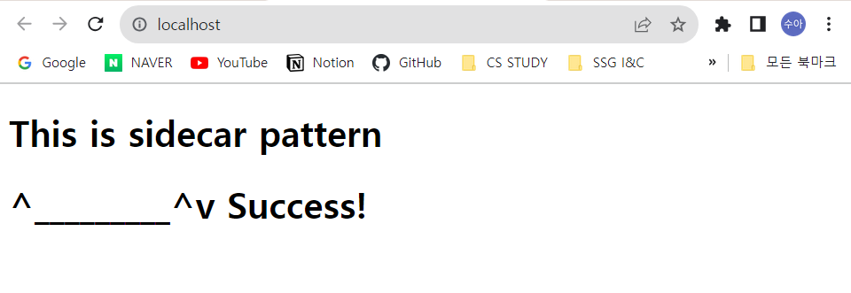

### 최신 컨텐츠를 제공하는 웹 애플리케이션 서버

**요구사항**   

두 개의 컨테이너로 구성된 어플리케이션을 개발  

첫번째 컨테이너는 주기적으로 깃 허브에서 컨텐츠(HTML)를 다운로드하는 쉘 스크립트가 동작  
깃 허브 주소는 컨테이너는 실행할 때 환경 변수로 전달 받아서 사용  

두번째 컨테이너는 nginx 서버가 동작  

**과정**

```powershell
// 볼륨 생성
docker volume create sidecar

// cloner image 생성 및 컨테이너 생성
docker image build -t cloner .
docker container run -d -e GITHUB_URL=https://github.com/Suah-Cho/sidecar.git -v sidecar:/data --name cloner cloner

// cloner container logs 확인
2023-09-27 08:30:28 Tue Sep 26 23:30:28 UTC 2023
2023-09-27 08:31:29 Already up to date.
2023-09-27 08:31:29 Tue Sep 26 23:31:29 UTC 2023
2023-09-27 08:32:29 Already up to date.
2023-09-27 08:32:29 Tue Sep 26 23:32:29 UTC 2023
2023-09-27 08:33:30 Already up to date.
2023-09-27 08:33:30 Tue Sep 26 23:33:30 UTC 2023
2023-09-27 08:34:31 Already up to date.
2023-09-27 08:34:31 Tue Sep 26 23:34:31 UTC 2023
2023-09-27 08:35:31 Already up to date.

// nginx 컨테이너 생성
docker container run -d -p 80:80 -v sidecar:/usr/share/nginx/html --name nginx nginx
```

**localhost에서 결과물 확인**
|before|after|
|---|---|
|||
