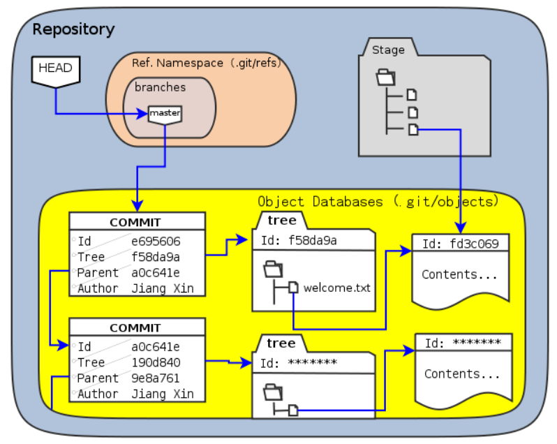

# Git 특강

### 1. Git

- 컴퓨터 파일의 변경 사항을 추적하고 여러 명의 사용자들 간에 해당 파일들의 작업을 조율하기 위한 스냅샷 스트림 기반의 분산 버전 관리 시스템
    - 버전을 넘나들면서 관리할 수 있는 것
    - 컴퓨터 파일의 변경 사항을 추적하고 여러 명의 사용자들이 관리할 수 있는 시스템
    - 협업(Collaboration) + 기록(Histroy)
    - snapshot
        - 특정 시간에 데이터 저장 장치의 상태를 별도로 파일이나 이미지로 저장하는 기술
        - 스냅샷 기능을 이용하여 데이터를 저장하면 유실된 데이터 복원과 일정 시점의 상태로 데이터를 복원 가
        - 버전이 추가될 때마다 기록되어있는 것

---

**Cloud Eng**

- 네트워크 망, 인프라 망을 구성
- 서로 연결하고 관리하는 것이 필요 → 클라우드 엔지니어

**Devops Eng**

- 전반적인 애플리케이션의 LIFE CYCLE을 관리해주는 사람
- -ops : ops앞에 붙은 사람이 집중할 수 있게 주위 환경을 세팅해주는 사람
- 도메인을 사용하는 사람이 계속해서 편하게 근무할 수 있도록 개선해주는 역할

---

**현업에서 협업은 필수 요소**

**Q. 기록은 왜 필요한가?**

: 옆에 있는 사람이 기록을 보고 더 좋은 결과물을 도출할 수 있도록 적는다는 마음을 가지고 있어야 한다.

> 회사에서 md파일이 잘 작성되어 있는 지원자를 더 좋게 본다.
> 

---

### 2. Github

- [GitHub copilot](https://github.com/features/copilot)
- [AI관련 최신 이슈 & 뉴스 볼 수 있는 곳(Voicevot)](https://voicebot.ai/)
    
    [Developers Are Quickly Adopting Generative AI Tools, Especially GitHub Copilot [Chart]](https://voicebot.ai/2023/08/22/developers-are-quickly-adopting-generative-ai-tools-especially-github-copilot-chart/)
    
- [요즘 IT](https://yozm.wishket.com/magazine/)
    
    [개발팀 퇴근시간을 앞당겨줄 Git, Github 팁 | 요즘IT](https://yozm.wishket.com/magazine/detail/1796/)
    
- [IT Chosun](https://it.chosun.com/)
    
    [[우리가 모르는 개발자 생태계] 개발할 때 깃(Git)을 써야 하는 이유](https://it.chosun.com/site/data/html_dir/2020/09/25/2020092500387.html)
    
- weaveworks : Guide To GitOps
    - GitOps - Git에만 작업해두면 (설정파일,업데이트) ⇒자동 배포 툴
    
    [GitOps what you need to know](https://www.weave.works/technologies/gitops/)
    
    - 자동 배포 툴
        - flux
        - Argo CD
    - Needs가 있지만 아직 GitOps가 100% 충족하지 못한다. → 고민해볼 문제

---

### 3. Git 기본 개념

- 용어 정리(release note 일기) - [gitglossary](https://git-scm.com/docs/gitglossary)
- version x.y.z ⇒ x : main, y : update, z : buge fix

| Branch | bare repository에서 하나 씩 꺼내서 작업하는 곳 |
| --- | --- |
| Commit | git에다 기록하는 하나의 시점으로 기록한 것(snapshot을 뜬 것) |
| CheckOut | 실제 내가 어떤 동작하고 있는 tree에서 어떤 data를 가져와서 쓸 것인지 체크하는 것 |
| Fetch | repository를 나&다수가 가지고 있을 때 서로 일치하는 지 확인하는 것 |

**3-1) Git object structure**

</img>

- [Git Object](https://sjh836.tistory.com/74)

- tree : 파일을 빠르게 찾기 위한 구조
- id
- commit : 이력을 보기 위한 상속 구조
    
  </img>
    
    - commit object 4대 원소
        - commit : meta data와 tree에 대한 pointer
        - tree : object 용량(size) + file 명 + 각 blob들에 대한 위치 정보
        - blob
        - tag

**3-2) Git Data Transport Commands**

</img>

- index : 읽기/쓰기/조회 속도 boost
- workspace / local repository / remote repository 구분 이유 = 분산 저장 이유(commit과 push로 나뉘는 이유)
    - 협업 시 충돌 방지 및 해결 위해
    - remote에 문제 발생 시 복구 용이하기 하기 위해
    - fetch를 통해 remote랑 local이 충돌하는지 확인

**3-3 Git 명령어**

| add | 색인하기 (index에 올리기) |
| --- | --- |
| fetch | remote repo와 local repo와 충돌 없는지 확인하고 local로 땡기기 |
| head | 가장 최신의 remote repo를 바라보도록! |
| checkout | 색인된 것 받아오기 |
| diff | 비교하기 |

**3-4 Git Code 관리 전략**

- 전략
    1. git flow
        1. git-flow cheatsheet :
        
        [git-flow cheatsheet](https://danielkummer.github.io/git-flow-cheatsheet/index.ko_KR.html)
        
        - git flow init
            - master
            - feature
            - develop
            - release
            - hotfixes
    2. github flow
    3. gitlab flow
    4. TBD
        
        [Git flow, GitHub flow, GitLab flow](https://ujuc.github.io/2015/12/16/git-flow-github-flow-gitlab-flow/)
        
        - merge하지 않아도 된다. → 충돌 x, 불필요한 commit 발생 x
        - commit을 함부로 하면 안됨 → 작업자가 commit 불가능. 별도의 관리자가 review후 commit
        
        [Trunk Based Development](https://trunkbaseddevelopment.com/)
        

### 4. GitHub 주요 기능

- org
- 오픈소스 기여하기 좋은 레포 : [github](https://github.com/github)
    - github이기반이 되는 레포들 → 잘 작성된 readme

### 5. GitHub Project 관리

- github의 프로젝트 관리 : issue 관리
    - issue & pull request → issue
- issue
    - 체계적인 template으로 관리하기
    - assignees
    - labels
    - milestone : 프로젝트를 좀 더 타이트하게 관리할 수 있음
        - 어떤 issue가 포함되는지, 얼마나 완료됐는지는 확인 가능
        - but 프로젝트가 실제로 어떻게 진행되고 있는지는 보기 어려움 → jira/trello로 관리
        → GitHub에서 제공하기 시작한 기능 : **Projects**
- Actions
    - 코드 관리 + 빌드&배포
- About
    - 해당 기술/오픈소스에 대한 개요/인사이트
- Releases
    - bug fixes - 해당 issue에 대한 태그 걸려있다.
- Packages
    - 실제 라이브러리를 담은 파일 등
    - 라이브러리 다운 할 때 (apm, yum, …)
- Contributer
    - commit활동 꾸준히 하는 사람들(친해지면 도움 많이 된다.)
- 오픈 소스 커뮤니티를 통해 개발자들과 연결 → 정보 얻기

### 6. GitHub / Code Review

- 코드 리뷰 잘하기
    
    [효과적인 코드리뷰를 위한 리뷰어의 자세](https://tech.kakao.com/2022/03/17/2022-newkrew-onboarding-codereview/)
    
    [글로벌기업은 코드 리뷰를 어떻게 할까요? | 인사이트리포트 | 삼성SDS](https://www.samsungsds.com/kr/insights/global_code_review.html)
    
- **code review**
    - 코드를 기반으로 팀의 다른 개발자가 피드백을 주고 받는 과정
    - 코드의 부작용과 오류를 release 전에 대응 가능
    - 기술 부채를 줄일 수 있다.
    - 코드 리뷰는 숙제 검사가 아니고 서로 공유하고 성장하는 과정
    - github pr(pull request) 활용
    - 리뷰할 것이 없다면 칭찬 (가급적 구체적인 칭찬)

### 7. CI/CD /GitHub

- 빌드 배포 전략 공유
1. build
    - Continuous Integration  (jenkins vs github action)
        - circle ci
        - travis ci (편한데 유료)
        - **jenkins**
            - 현재 가장 많이 사용 중, 무료
        - github action
            - 가장 트렌드
    - build
        - gradle
        - maven
    - repository
        - artifact repository
        - aws amazon ECR
2. test
3. deploy
4. run
5. monitor
    - 중요한 거~! : Cloud Infra
        - **prometheus**
            - 시각화 툴
        - **grafana**
            - 시각화 metric 등을 본질적인 것들을 제공
            - 클라우드 인프라를 모니터링할 수 있다
6. manage & notify 
    - project management
        - jira
        - trello
        - confluence

- argo cd
    - 쿠버네티스 안쪽에 설치
    - 파이프라인 예제
        - github action + ecr + argo cd
            
            [Github Action + ECR + Argocd 연동기](https://viassh.github.io/network/github-action-ecr-cicd/)
            
        - aws 의존적 파이브라인

---

 취업특강 

    
    wanted
    
    - cloud engineer
    - devops engineer
    
    신입인 경우 JD가 구체적인 회사가 좋다.
    
    1. 우대조건이 디테일한지.
    2. 우대조건이 명확한지.
    
    ‘나 이런 사람이고 너네랑 잘 맞을걸?’을 어필하는 게 더 매력적임 → 자소서를 회사에 맞춰서 제출
    
    우대사항이 나에게 해당하는 비율이 높으면 합격할 확률이 높음
    
    ex) 카카오뱅크 우대사항
    
    - 툴을 먼저 적어놨다 → ci/cd
    - go, ruby, kotiln, javascript, java 등이지만 등 빼고 생각 & 자기들이 선호하는 언어대로 적은 것이어서 go, ruby, kotiln중에 할 줄 아는게 좋다.
    
    → 개발도 어느 정도한다.
    
    ex) 두나두
    
    </img>
    
    → 추상적으로 설명한 것은 팀을 현재 빌딩하거나 처음 뽑는다고 생각
    
    → 운영 경험이 있어야 하기 때문에 신입이 들어가기가 어려움.
    
    ex) 화해
    
   </img>
    
    우대사항이 많은 회사일 경우 우대사항 중 하나만 해봤을 경우 신입이 들어갈 확률이 높다. 
    
    ex) 현대캐피탈
    
    </img>
    
    불명확하거나 포지션이 일관되지 않으면 지원하지 않는 것이 좋다.
    
    ex) 롯데헬스케어
    
   </img>
    
    - 5년 이상의 경험 : 해당하지 않아도 되지만, 그만큼 잘해야한다는 것
        - 5년 이상 : 뭔가를 같이 고민할 수 있을 만하나 레벨(주니어 레벨)
        - 3년 이상 : 뭔가를 시켰을 때 완벽하게 도출할 수 있을 레벨
        - 1년 이상 : 옆에서 도움을 주면 도출해낼 수 있을 레벨
    
    - cloud eng vs devops eng
        
        신입은 devops eng 합격률이 더 높다.
        
    
    이력서 & 자소서
    
    1. 전공, 비전공인지 중요하지 x → 블라인드 상태로 넘어옴
        
        **코테 점수**, 이름, 나이 
        
        자소서의 프로젝트 기반으로 질문에 대한 답변으로 합불합이 나뉜다.
        
        (**문제 해결에 대한 고민**을 어떻게 했다는 내용을 이야기해야 좋다.)
        
        이 것을 왜 선택했고, 앞으로 어떻게 나아 갈 건지에 대한 이야기를 해야 한다.
        
        면접에 가서 면접관에게 잘 설명할정도로만 하는게 좋다.
        
        내가 이야기하기 어려운 부분에 대해서는 다 빼는 게 좋다. (ex. 프로젝트에서 디비만 했다만 디비 빼고 다 빼도 좋다.)
        
    2. cs관한 질문은 정보처리기사(산업기사)를 달달 외워도 됨.
        
        
    
    온라인코딩테스트
    
    - 프로그래머스
    - 백준 → 코테 공부 다하고 시간이 남아서 심심할 때 푸는 것. (모의고사처럼 사용할 것이냐? X)
        - 시험을 준비한다고 하면 LeetCode
        - 카카오는 leetCode 중 몇 개 틀어 놓는다.
        
    - 요즘 추세
        - 6문제 - 120분
            
            leetCode 미디엄 문제를 15분안에 풀 수 있는 연습을 해야한다.
            
            - 한 10~15분 공책에 알고리즘&자료구조를 뭐 써야한다. 생각했는데 생각이 안나면 바로 답지 보고 넘어가라.
            - 이후 오답노트처럼 외워라.
            - 하루에 1시간 정도씩만 코테를 풀어라. (하루에 3문제)
            
    
    CS
    
    - os는 면접가기 직전에 봐도 됨.
    - 중요한 건 네트워크랑 웹 브라우저(웹 동작 과정을 많이 물어봄)
        - 웹 브라우저에서 url을 입력하고 첫 화면이 출력되기까지 어떤 과정을 거치는가?
        
    
    포트폴리오/자격증

    - 면접관이 나에게 바라는 것을 적는 것
        
        어떤 기술을 사용하여서 프로젝트를 진행했고, 어떤 라이브러리를 썼고, 어떤 문제점이 있었으며, 다음에 어떤 기대효과(?)가 있을 거라고 생각하는지?를 적어야한다.
        
    - 성과를 적었을 때 합격해주는 것
        
        si 업계(+정보처리기사)
        
        - si업계의 경우에는 정처기가 가산점이 된다.
        - 다른 업계에서는 큰 도움이 안된다.

