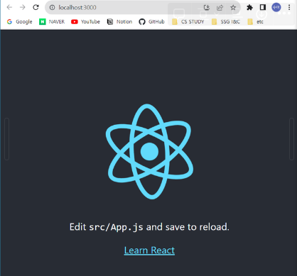
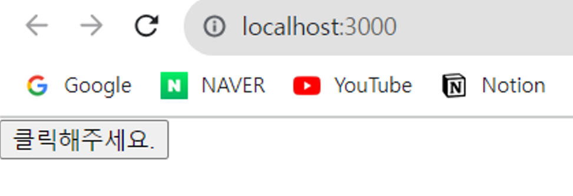
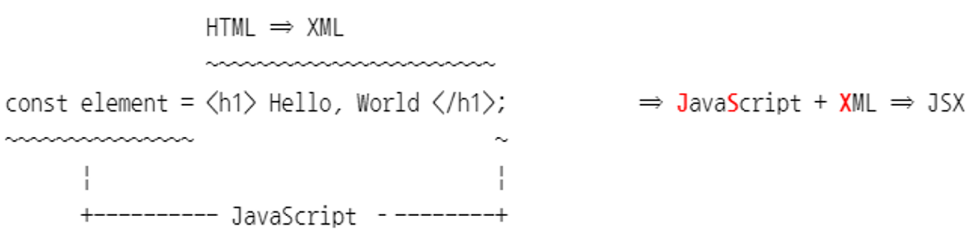

# React_03

## React

*A JavaScript libarary for building user interfaces.*

- SPA를 쉽고 빠르게 만들 수 있도록 해주는 도구
- 장점
    - 빠른 업데이트와 렌더링 속도(Virtual DOM사용)
    - 컴포넌트 기반 구조
    - 재사용성이 좋다.
        - 개발 기간이 단축된다.
        - 유지 보수가 용이하다.
    - 메타(페이스북)의 지원
    - 활발한 커뮤니티
    - 모바일 앱 개발 가능(React Native)
- 단점
    - 높은 상태 관리 복잡도

<aside>
💡 프레임 워크 vs 라이브러리

- 프레임 워크
    - 흐름의 제어 권한을 개발자가 아닌 프레임워크가 가지고 있다.
- 라이브러리
    - 흐름에 대한 제어를 하지 않고 개발자가 필요한 부분만 필요할 때 가져다 사용하는 형태
</aside>

### 일반 웹 페이지에 react.js파일을 추가해서 기능을 구현

sample.html

```html
<!DOCTYPE html>
<html lang="en">
<head>
    <meta charset="UTF-8">
    <meta name="viewport" content="width=device-width, initial-scale=1.0">
    <title>Document</title>

    <!--
        #1 리액트 자바스크립트 파일을 추가
        https://ko.legacy.reactjs.org/docs/cdn-links.html
    -->
    <script crossorigin src="https://unpkg.com/react@18/umd/react.development.js"></script>
    <script crossorigin src="https://unpkg.com/react-dom@18/umd/react-dom.development.js"></script>
</head>
<body>
    <!--
        #2 DOM Container 추가
           ~~~~~~~~~~~~~
           Root DOM Node => Virtual DOM의 시작
    -->
    <div id="root"></div>

    <!--
        #3 리액트 컴포넌트 코드를 추가
    -->
    <script src="MyButton.js"></script>
</body>
</html>
```

MyButton.js

```jsx
function MyButton() {
    const [ isClicked, setisClicked ] = React.userState(false);

    // <**button** **onClick="콜백함수"**>**내용**</button>
    return React.createElement(
        '**button**',
        **{ onclick: () => setisClicked(!isClicked) }**,
        isClicked ? **"클릭되었습니다." : "클랙해주세요."**
    );
}

const domContainer = document.querySelector("root");
// ReactDOM.render(React.createElement(MyButton), domContainer);
ReactDOM.createRoot(domContainer).render(React.createElement(MyButton));
```

### **create-react-app**

리액트로 웹 애플리케이션을 개발하는 데 필요한 모든 설정이 되어 있는 상태의 프로젝트를 생성해주는 도구

```bash
npx create-react-app <project name>
```

**개발 서버 실행**

```bash
cd my-app
npm start
```



src/App.js

```jsx
import logo from './logo.svg';
import './App.css';
import { useState } from 'react';

function App() {
  const [ isClicked, setisClicked ] = useState(false);
  return (
    <button onClick={() => setisClicked(!isClicked)}>
      {isClicked ? "클릭되었습니다." : "클릭해주세요."}
      </button>
  );
}

export default App;
```


## JSX

A syntax extension to JavaScript ⇒ 자바스크립트 확장 문법



<aside>
💡

```html

```

- *img*
    - 태그(tag)
        - 시작 태그와 종료 태그로 구성 → 종료 태그가 생략되거나 자기 종료되는 경우가 있다.
        - 시작 태그와 종료 태그
            - <div> … </div>
                - 시작 태그와 종료 태그 사이에는 내용(contents)이라고 하고 텍스트 또는 또 다른 태그가 들어갈 수 있다.
        - 종료 태그가 생략되거나 자기 종료하는 경우
            - 종료 태그 생략
                - <input type=”text” …>
            - 자기 종료하는 경우
                - 
- *src="/images/data/test.png" width="100" height="100 onClick="..." style="border: 1px solid red;"*
    - 속성(attribute)
        - 태그를 처리하는데 필요한 부가적인 정보
            - 태그에 특화된 속성
                - src=”..”
            - 스타일과 관련된 속성
                - width=”100”, height=”100”
                - style=”border:1px solid red;”
            - 이벤트 핸들러
                - onclick=”…”
- 요소
    - 태그 + 속성 + 콘텐츠
</aside>

### createElement() 함수

```jsx
React.createElement(
			type ,           // 엘리먼트의 유형, HTML 태그 또는 다른 리액트 엘리먼트
			[props],         // 부모 엘리먼트에서 자식 앨리먼트에게 전달하는 값
			[...children]    // 현재 엘리먼트가 포함하고 있는 자식 엘리먼트
)
```

## JSX

### **JSX의 역할**

JSX는 내부적으로 XML/HTML 코드를 JavaScript로 변환하는 과정을 거침

- crateElement()함수가 JavaScript로 변환

⇒ JSX를 사용했을 때 코드가 더욱 간결해지고 생산성과 가독성이 향상된다.

**순수 자바스크립트로 만든 코드**

```jsx
function MyButton() {
    const [ isClicked, setIsClicked ] = React.useState(false);

    return React.createElement(
        'button',
        { onClick: () => setIsClicked(!isClicked) },
        isClicked ? "클릭되었습니다." : "클릭해주세요."
    );
}

const domContainer = document.querySelector('#root');
ReactDOM.createRoot(domContainer).render(React.createElement(MyButton));
```

**JSX로 작성한 코드**

```jsx
function App() {
  const [isClicked, setIsClicked] = useState(false);

  return (
    <button onClick={() => setIsClicked(!isClicked)}>
      {isClicked ? "클릭되었습니다." : "클릭해주세요."}
    </button>
  );
}

const root = ReactDOM.createRoot(document.getElementById('root'));
root.render(<App />);
```

### JSX의 장점

- **코드가 간결해진다.**

```jsx
### 사용하지 않는 경우
React.createElement('div', null, `Hello, ${name}`);

### JSX를 사용하는 경우 
<div>Hello, {name}</div>
```

- **가독성이 향상되고 유지보수성이 좋아진다.**
- **보안성이 향상된다. ⇒ XSS 공격을 방어할 수 있다.**

### JSX 사용법

*create-react-app으로 생성한 my-app프로젝트의 App.js 파일을 수정하면서 실습 진행*

**1. 반드시 부모 요소 하나로 감싸야 한다.**

방법1. <div>와 같은 태그로 감싸는 방법

방법2. Fragement 컴포넌트를 이용 ⇒ 불필요하게 태그가 추가되는 것을 방지

방법3. Fragement를 축약 방식을 사용

**2. JSX 안에서는 자바스크립트와 표현식을 {}로 감싸서 작성**

```jsx
function App() {
  const name= '홍길동'
  const age = 24;
  return (  // 화면에 출력될 요소들을 return에 작성
    <>
      <h1>안녕, 나는 {name}이고 {age}이야.</h1>
      <h2>내년에 내 나이는 {age+1}이야.</h2>
    </>
  );
}

export default App;
```

**3. JSX 내부에서는 자바스크립트의 if문을 사용할 수 없으므로, 삼항 연산자를 사용해야한다.**

<aside>
💡 삼항 연산자

```jsx
조건식 ? 참인 경우 : 거짓인 경우
```

⇒ if ( 조건식 ) { 참인 경우 } else { 거짓인 경우 }

</aside>

```jsx
function App() {
  const name= '홍길동'
  const age = 24;
  return (
    <>
      <h1>안녕, 나는 {name}이고 {age}이야.</h1>
      <h2>{ name == '홍길동' ? '환영합니다.' : '누구세요?'}</h2>
      
    </>
  );
}

export default App;
```

**4. 조건을 만족할 때만 내용을 보여줄 경우 ⇒ 조건부 렌더링**

방법1. 삼항 연산자를 사용하는 경우

```jsx
function App() {
  const name= '홍길동'
  const age = 25;
  return (
    <>
      <h1>안녕, 나는 {name}이고 {age}이야.</h1>
      <h2>{ name == '홍길동' ? '환영합니다.' : null}</h2>  // 조건을 만족하지 않는 경우 null 반환 -> 화면에 내용이 출력되지 않는다.
      
    </>
  );
}

export default App;
```

방법2. &&연산자를 이용

```jsx
function App() {
  const name= '홍길동'
  const age = 25;
  return (
    <>
      <h1>안녕, 나는 {name}이고 {age}이야.</h1>
      { name == '홍길동' && <h2>환영합니다.</h2> }
      
    </>
  );
}

export default App;
```

**5. 함수에서 undefined를 반복하지 않도록 해야 한다.**

```jsx
function App() {
  const name = undefined;  
  return name || 'undefined 입니다.';   // ||연산자를 이용해서 undefined 의 경우 사용할 기본값을 지정할 수 있다.
}                                       // undefined는 false로 반환

export default App;
```

**6. 인라인 스타일링**

DOM 요소에 스타일을 적용할 때는 객체 형태로 적용해야 하며, 스타일 이름은 카멜 표현식을 사용

```jsx
function App() {
  const name= '리액트'
  const nameStyle = {
    backgroundColor: "black",
    color: 'yellow',
    fontSize: 48, // 단위 생략하면 'px'이 기본 단위
    padding: '16px'
  }
  return (
    <div style={nameStyle}>
      {name}
    </div>
  );
}

// style을 inline형식으로 표현하면 중괄호를 2개써야한다.
export default App;

function App() {
  const name = '리액트';
               +--------------------------- 표현식 ----------------------------------------+ 
  return (     |                                                                            |
    <div style={{ backgroundColor: 'black', color: 'yellow', fontSize: 48, padding: '16px' }}>
      {name}    |                                                                          | 
    </div>      +------------------ 객체 --------------------------------------------------+
  );
}

export default App;
```

**CSS 클래스를 사용할 때 class가 아닌 className으로 설정**

App.css

```css
.react {
  background-color: black;
  color: yellow;
  font-size: 48px;
  padding: 16px
}
```

App.js

```jsx
import './App.css';

function App() {
  const name= '리액트'
  const nameStyle = {
    backgroundColor: "black",
    color: 'yellow',
    fontSize: 48, // 단위 생략하면 'px'이 기본 단위
    padding: '16px'
  }
  return (
    <div className='react'>
      {name}
    </div>
  );
}

export default App;
```

**8. 모든 태그는 반드시 닫는 태그를 사용해야함**

내용(contents)이 없는 태그는 self-closing태그를 사용

```jsx
import './App.css';

function App() {
  const name = '리액트';
  return (
    <>
      <div className="react">{name}</div>

      <input type="text"></input>
      <input type="text" />
      <input type="text">   ⇐ Unterminated JSX contents. (닫는 태그를 사용
    </>
  );
}

export default App;
```

**9. 주석(comment)**

```jsx
import './App.css';

function App() {
  // 인라인 주석
  const name = '리액트';    // 인라인 주석 
  /*
      블럭 단위 주석
  */

  return (
    // 인라인 주석
    /*
       블럭 단위 주석
    */
    <>
      // 텍스트로 인식
      /* 
        텍스트로 인식
      */
      { /*
          요렇게 해약 주석 처리가 가능 
        */ }
      { // 요렇게 하는 것도 가능
      }
      {
        // 물론 요렇게 하는 것도 가능        
      }
      { // 이렇게 하면 닫는 중괄호가 해석도지 않을 을 수 있음... }
      }
      <div className="react">{name}</div>
    </>
  );
}

export default App;
```

## 클래스형 컴포넌트

**src/MyCompononetClass.js 파일을 추가**

```jsx
import { Component } from "react";

class MyComponentClass extends Component {

    render() {
        return (
            <>
                <h1>이름은 홍길동입니다.</h1>
                <h1>나이는 23살 입니다.</h1>

            </>
        );
    }
}

export default MyComponentClass;
```

**App.js 파일에 MyComponentClass 컴포넌트를 추가**

App.js

```jsx
import './App.css';
import MyComponentClass from './MyComponentClass';

function App() {
  
  return (
    <>
      <MyComponentClass/>
    </>
  );
}

export default App;
```

**함수형 컴포넌트**

**MyComponentFunction.js파일을 추가**

```jsx
function MyComponentFunction () {
    return (
        <>
            <h1>이름은 홍길동입니다.</h1>
            <h2>나이는 23살입니다.</h2>
        </>
    )
}

export default MyComponentFunction;
```

App.js

```jsx
import './App.css';
import MyComponentFunction from './MyComponentFunction';

function App() {
  
  return (
    <>
      <MyComponentFunction/>
      
    </>
  );
}

export default App;
```

### props 활용

- properties 줄임말
- 컴포넌트의 속성을 설정할 때 사용
- props 같은 해당 컴포넌트를 사용하는 `부모 컨포넌트에서 설정`
- 컴포넌트 `자신은 해당 props 값을 읽기 전용`으로 사용만 가능

**App.js 파일에서 MyComponentClass와 MyComponentFunction 컴포넌트에 name 속성과 값을 부여**

```jsx
import './App.css';
import MyComponentClass from './MyComponentClass';
import MyComponentFunction from './MyComponentFunction';

function App() {
  
  return (
    <>
      <MyComponentClass name='고길동'/>
      <hr/>
      <MyComponentFunction name='신길동'/>
      
    </>
  );
}

export default App;
```

**MyComponentClass 컴포넌트에 props 값을 활용하도록 수정**

```jsx
import { Component } from "react";

class MyComponentClass extends Component {

    render() {
        console.log(this);
        console.log(this.props.name);
        return (
            <>
                <h1>이름은 {this.props.name}입니다.</h1>
                <h2>나이는 23살 입니다.</h2>

            </>
        );
    }
}

export default MyComponentClass;
```

**MyComponentFunction 컴포넌트에 props 값을 활용하도록 수정**

```jsx
// 1
function MyComponentFunction (props) { // 매개변수여서 다른 이름으로 지정해도 되지만 관례적으로 props로 사용한다.
    console.log(props);  // {name: '신길동'}
    return (
        <>
            <h1>이름은 {props.name}입니다.</h1>
            <h2>나이는 23살이다.</h2>
        </>
    )
}

export default MyComponentFunction;

// 2
function MyComponentFunction ({name}) {
    console.log(name);  // 신길동
    return (
        <>
            <h1>이름은 {name}입니다.</h1>
            <h2>나이는 23살이다.</h2>
        </>
    )
}

export default MyComponentFunction;
```

**App.js 파일에 여러 값을 자식 컴포넌트로 전달하도록 수정**

```jsx
import './App.css';
import MyComponentClass from './MyComponentClass';
import MyComponentFunction from './MyComponentFunction';

function App() {
  return (
    <>
      <MyComponentClass name="신길동" age={23} nickname={"길동"} />
      <hr/>
      <MyComponentFunction name="고길동" age={40} nickname="길동" />
    </>                                      ~~~~
  );                                         숫자인 경우 { }로 묶어서 표현
}

export default App;
```

**MyComponentClass 컴포넌트에서 props변수를 받아서 출력**

```jsx
import { Component } from "react";

class MyComponentClass extends Component {
    render() {
        return (
            <>
                <h1>이름은 {this.props.name}입니다.</h1>
                <h2>나이는 {this.props.age}살입니다.</h2>
                <h2>별명은 {this.props.nickname}입니다.</h2>
            </>
        );
    }
}

export default MyComponentClass;
```

**객체 비구조화를 이용해서 코드를 단순화**

```jsx
import { Component } from "react";

class MyComponentClass extends Component {
    render() {
        const { name, age, nickname } = this.props; 	// {name: '신길동', age: 23, nickname: '길동'}
        return (
            <>
                <h1>이름은 {name}입니다.</h1>
                <h2>나이는 {age}살입니다.</h2>
                <h2>별명은 {nickname}입니다.</h2>
            </>
        );
    }
}

export default MyComponentClass;
```

**MyComponentFunction 컴포넌트에서 props 변수를 받아서 출력**

```jsx
function MyComponentFunction(props) {
    return (
        <>
            <h1>이름은 {props.name}입니다.</h1>
            <h2>나이는 {props.age}살입니다.</h2>
            <h2>별명은 {props.nickname}입니다.</h2>
        </>
    );
}

export default MyComponentFunction;
```

**객체 비구조화를 이용해서 코드를 단순화**

```jsx
function MyComponentFunction(props) {
    const { name, age, nickname } = props;
    return (
        <>
            <h1>이름은 {name}입니다.</h1>
            <h2>나이는 {age}살입니다.</h2>
            <h2>별명은 {nickname}입니다.</h2>
        </>
    );
}

export default MyComponentFunction;
```

**매개변수를 객체 비구조화하도록 정의**

```jsx
function MyComponentFunction({ name, age, nickname }) {
    return (
        <>
            <h1>이름은 {name}입니다.</h1>
            <h2>나이는 {age}살입니다.</h2>
            <h2>별명은 {nickname}입니다.</h2>
        </>
    );
}

export default MyComponentFunction;
```

**props 값이 누락된 경우**

App.파일에 props 값을 전달하지 않도록 수정

```jsx
import './App.css';
import MyComponentClass from './MyComponentClass';
import MyComponentFunction from './MyComponentFunction';

function App() {
  return (
    <>
      <MyComponentClass />
      <hr/>
      <MyComponentFunction />
    </>  
  );
}

export default App;
```

defaultProps 설정이 가능

```jsx
// 클래스
import { Component } from "react";

class MyComponentClass extends Component {
    render() {
        const { name, age, nickname } = this.props; // {name: '신길동', age: 23, nickname: '길동'}
        return (
            <>
                <h1>이름은 {name}입니다.</h1>
                <h2>나이는 {age}살입니다.</h2>
                <h2>별명은 {nickname}입니다.</h2>
            </>
        );
    }
}

MyComponentClass.defaultProps = {
    name: '아무개', 
    age: 0, 
    nickname: '없음'
};

export default MyComponentClass;

// 함수
function MyComponentFunction({ name, age, nickname }) {
    return (
        <>
            <h1>이름은 {name}입니다.</h1>
            <h2>나이는 {age}살입니다.</h2>
            <h2>별명은 {nickname}입니다.</h2>
        </>
    );
}

MyComponentFunction.defaultProps = {
    name: '아무개', 
    age: 0, 
    nickname: '없음'
};

export default MyComponentFunction;
```

**props.children**

App.js파일을 아래와 같이 수정 → 자식 컴포넌트에 내용(contents)을 추가

```jsx
import './App.css';
import MyComponentClass from './MyComponentClass';
import MyComponentFunction from './MyComponentFunction';

function App() {
  return (
    <>
      <MyComponentClass>
        <i>어떤 내용</i>
      </MyComponentClass>
      <hr/>
      <MyComponentFunction>
        <i>또 어떤 내용</i>
      </MyComponentFunction>
    </>  
  );
}

export default App;
```

화면에서 <i>태그의 내용이 출력되지 않는 것을 확인할 수 있다.

**MyComponentClass 컴포넌트에 내용을 출력하는 코드를 추가**

```jsx
import { Component } from "react";

class MyComponentClass extends Component {
    render() {
        console.log(this.props);
        const { name, age, nickname } = this.props; // {name: '신길동', age: 23, nickname: '길동'}
        return (
            <>
                <h1>이름은 {name}입니다.</h1>
                <h2>나이는 {age}살입니다.</h2>
                <h2>별명은 {nickname}입니다.</h2>
                <div>{this.props.children}</div>
            </>
        );
    }
}

MyComponentClass.defaultProps = {
    name: '아무개', 
    age: 0, 
    nickname: '없음'
};

export default MyComponentClass;
```

**MyComponentFunction 컴포넌트에 내용을 출력하는 코드를 추가**

```jsx
function MyComponentFunction({ name, age, nickname, children }) {
    return (
        <>
            <h1>이름은 {name}입니다.</h1>
            <h2>나이는 {age}살입니다.</h2>
            <h2>별명은 {nickname}입니다.</h2>
            <div>{children}</div>
        </>
    );
}

MyComponentFunction.defaultProps = {
    name: '아무개', 
    age: 0, 
    nickname: '없음'
};

export default MyComponentFunction;
```

**데이터를 가공해서 출력**

```jsx
import './App.css';
import MyComponentClass from './MyComponentClass';
import MyComponentFunction from './MyComponentFunction';

function App() {
  const datas = [
    { name : '홍길동', age: 23, nickname: '호부호형을 원하는 자'},
    { name : '고길동', age: 40, nickname: '둘리가 싫은 자'},
    { name : '신길동', age: 50, nickname: '신길동 매운 짬뽕'}
  ]
  return (
    <>
      {
        datas.map(data => <MyComponentClass name={data.name} age={data.age} nickname={data.nickname}><i>어떤 내용</i></MyComponentClass>)

      }
      <hr/>
      <MyComponentClass>
        <i>어떤 내용</i>
      </MyComponentClass>
      <hr/>
      <MyComponentFunction>
        <i>또 어떤 내용</i>
      </MyComponentFunction>
    </>  
  );
}

export default App;
```

**신호등(모양)을 출력하는 컴포넌트를 작성**

App.js 파일에 일정한 크기의 Lamp를 포함한 TrafficLight 컴포를 포함

TrafficLight 컴포넌트는 빨강, 초록, 노랑 속성을 가지는 같은 크기의 Lamp 컴포넌트 세 개를 포함

Lamp 컴포넌트는 색상과 크기를 부모 컴포넌트(TrafficLight)로부터 전달 받아서 해당 색상과 크기의 원을 출력

100px의 붉은색 동그라미를 출력 ⇒ <div style={{ width: 100, height: 100, borderRadius:50, backgroundColor:’red’ }}