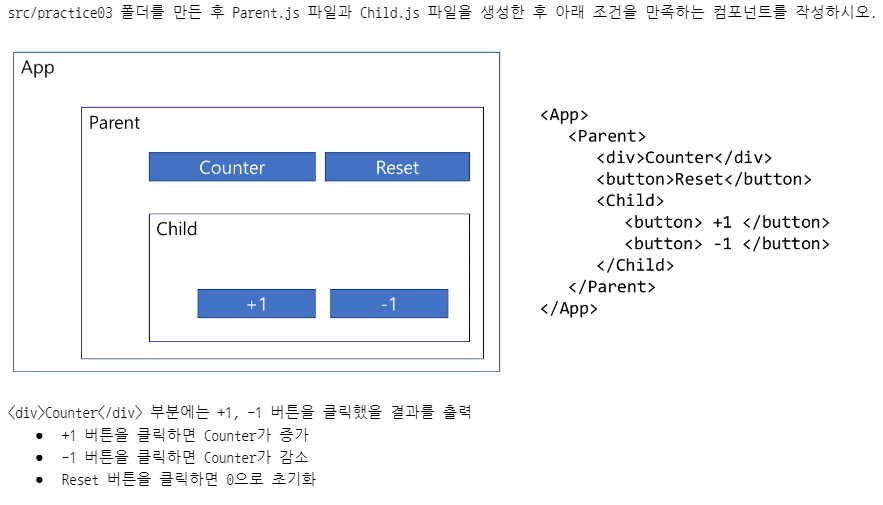
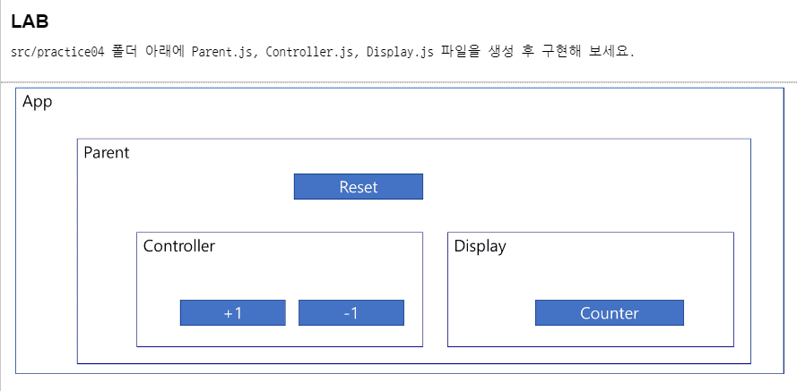

### state 변수와 생명주기 함수를 사용

생명주기 함수를 사용하기 위해서는 클래스형 컴포넌트로 구현해야함 ⇒ 함수형 컴포넌트는 훅(hook) 함수를 통해서 비슷하게 구현이 가능

src\lifecycle\Notification.js

```jsx
import { Component } from "react";

const styles = {
    wrapper : {
        border : '1px solid gray',
        borderRadius : 16,
        margin : 8,
        padding: 8
    },
    messageText : {
        color : 'black',
        fontSize : 16
    }
}

class Notification extends Component {
    constructor(props) {
        super(props);
    }
    render() {
    
        return (
            <>
                <div style={styles.wrapper}>
                    <span style={styles.messageText}>{this.props.message}</span>
                </div>
            </>
        );
    }
}

export default Notification;
```

src\lifecycle\NotificationList.js

```jsx
import { Component } from "react";
import Notification from "./Notification";

class NotificationList extends Component {
    render() {
        return (
            <>
                <Notification message="fisrt"/>
                <Notification message="second"/>

            </>
        );
    }
}

export default NotificationList;
```

**NotificationList 컴포넌트에서 출력할 메시지를 저장하는 상태변수를 정의하고, 해당 상태변수를 이용해서 Notification 컴포넌트를 동적으로 추가하도록 수정**

NotificationList.js

```jsx
import { Component } from "react";
import Notification from "./Notification";

class NotificationList extends Component {
    constructor() {
        super()
        this.state = {
            messages : ['first', 'second', 'third']
        };
    }
    render() {
        return (
            <>
                {

                    this.state.messages.map(msg => <Notification message={msg}/>)
                }

            </>
        );
    }
}

export default NotificationList;
```

**상태변수에 초기값이 없는 상태에서 NotificationList 컴포넌트가 마운트된 후 3초 간격으로 상태변수에 값을 추가하도록 수정**

**index.js.파일에 <React.StrictMode>를 주석처리**

NotifiactionList.js : construct() 함수에 데이터를 가져와서 상태변수에 추가하는 로직을 구현

```jsx
import { Component } from "react";
import Notification from "./Notification";

// 서버로부터 데이터를 가져오는 함수를 정의
// 데이터를 가져오는데 약 10초가 걸리는 것으로 가정
const getMessageFromServerOver10seconds = () => {
    console.log(">>>", new Date());

    let wakeUpTime = new Date();
    wakeUpTime.setSeconds(wakeUpTime.getSeconds() + 10);

    while(Date.now() < wakeUpTime) {
        // 10초 동안 반복
    }

    console.log('>>>', new Date());
    return ['first msg', 'second msg', 'third msg']
};

// message 상태변수에 넣어 줄 값을 정의 => 서버로 부터 가져올 값
let messagesFromServer = [];

// 타이머 제어를 위한 변수
// setInterval() 함수가 반환하는 값을 저장하고, clearInterval() 함수에서 사용
let timer;

class NotificationList extends Component {
    constructor() {
        console.log('#1 생성자 함수 호출');
        super()
        this.state = {
            messages : []
        };
        messagesFromServer = getMessageFromServerOver10seconds();
        
        timer = setInterval(() => {
            console.log('#4. 콜백 호출');

            const { messages } = this.state;

            if (messages.length <  messagesFromServer.length) {
                const msgIdx = messages.length;
                messages.push(messagesFromServer[msgIdx]);
                console.log('#5. 상태 변수 변경', messages);
                this.setState({messages});
            } else {
                console.log('#6. 타이머 중지');
                clearInterval(timer);
            }
        }, 3000);
    }

    componentDidMount () {
        console.log('#3. componentDidMout() 호출');
    }

    componentDidUpdate(prevProps, prevState, snapshot) {
        console.log('#3. componentDidUpdate() 호출')
    }

    render() {
        console.log('#2 render() 호출')
        return (
            <>
                {
                    this.state.messages.length === 0 && '데이터를 준비 중 입니다. 잠시 기다려 주세요.'
                }
                {
                    this.state.messages.map((msg, idx)=> <Notification key={idx} message={msg}/>)
                }

            </>
        );
    }
}

export default NotificationList;
```

**PROBLEM1. 데이터를 가져오는 동안 화면에 아무런 출력이 없다.**

**최초 마운트된 이후에 외부 연동을 하도록 수정**

```jsx
import { Component } from "react";
import Notification from "./Notification";

// 서버로부터 데이터를 가져오는 함수를 정의
// 데이터를 가져오는데 약 10초가 걸리는 것으로 가정
const getMessageFromServerOver10seconds = () => {
    console.log(">>>", new Date());

    let wakeUpTime = new Date();
    wakeUpTime.setSeconds(wakeUpTime.getSeconds() + 10);

    while(Date.now() < wakeUpTime) {
        // 10초 동안 반복
    }

    console.log('>>>', new Date());
    return ['first msg', 'second msg', 'third msg']
};

// message 상태변수에 넣어 줄 값을 정의 => 서버로 부터 가져올 값
let messagesFromServer = [];

// 타이머 제어를 위한 변수
// setInterval() 함수가 반환하는 값을 저장하고, clearInterval() 함수에서 사용
let timer;

class NotificationList extends Component {
    constructor() {
        console.log('#1 생성자 함수 호출');
        super()
        this.state = {
            messages : []
        };
        
    }

    componentDidMount () {
        console.log('#3. componentDidMout() 호출');

        messagesFromServer = getMessageFromServerOver10seconds();
        
        timer = setInterval(() => {
            console.log('#4. 콜백 호출');

            const { messages } = this.state;

            if (messages.length <  messagesFromServer.length) {
                const msgIdx = messages.length;
                messages.push(messagesFromServer[msgIdx]);
                console.log('#5. 상태 변수 변경', messages);
                this.setState({messages});
            } else {
                console.log('#6. 타이머 중지');
                clearInterval(timer);
            }
        }, 3000);
    }

    componentDidUpdate(prevProps, prevState, snapshot) {
        console.log('#3. componentDidUpdate() 호출')
    }

    render() {
        console.log('#2 render() 호출')
        return (
            <>
                {
                    this.state.messages.length === 0 && '데이터를 준비 중 입니다. 잠시 기다려 주세요.'
                }
                {
                    this.state.messages.map((msg, idx)=> <Notification key={idx} message={msg}/>)
                }

            </>
        );
    }
}

export default NotificationList;
```

**SOLVE. 데이터를 가져오는 동안 안내 메시지가 출력 된다. ⇒ componentDidMount에 안내 메시지를 넣는 것이 좋다.**

## 이벤트 핸들링

### 리액트에서 이벤트를 사용할 대 주의사항

**이벤트 이름은 카멜 표현식을 사용**

```jsx
onclick (x)
OnClick (x)
onClick (o)

onkeyup (x)
OnKeyUp (x)
onKeyUp (o)
```

**이벤트 핸들러로 자바스크립트 코드를 사용할 수 없고, 함수 형태로 전달**

```jsx
HTML => <button onClick='console.log('클리되었습니다.')'/>
react => <button onClick={ () => console.log('클릭되었습니다.')} />
```

**App.js 파일에 MyEventSample 컴포넌트를 정의**

```jsx
import { Component } from 'react';

class MyEventSample extends Component {
  // 이벤트 핸들러 함수를 정의 (9)일반적으로 접두어로 on또는 handler를 사용)
  handlerClick = () => alert('button is clicked');
  render() {

    return (
      <>
      {/* 이벤트 핸들러를 직접 구현 */}
        <button onClick={ () => console.log("클릭되었습니다.")}>클릭</button>
        <button onClick={ () => alert('button is clicked')}>클릭하시오.</button>
      
      {/* 외부에 정의한 함수를 이벤트 핸들러로 설정 */}
        <button onClick={this.handlerClick}>버튼눌러봐~</button>
      </>
    );
  }
}

function App() {
  return (
    <>
      <MyEventSample/>
    </>  
  );
}

export default App;
```

**이벤트는 DOM 요소(element)에만 사용이 가능**

- DOM 요소
    - HTML 태그

```jsx
<div onMouseOver={ () => {...} }> ... </div> (o)
<MyComponent onMouseOver={ () -> {...}> ... </MyComponent> (x)
=> MyComponent는 컴포넌트이므로 이벤트 설정이 불가
=> div는 HTML DOM 요소이므로 이벤트 설정이 가능
```

**리액트에서 처리할 수 있는 이벤트 종류**

https://legacy.reactjs.org/docs/events.html#supported-events

이벤트 종류마다 처리에 필요한 정보가 다르고, 해당 정보는 이벤트 객체(이벤트 핸들러 함수의 매개변수로 전달)를 통해서 전달

```jsx
import { Component } from 'react';

class MyEventSample extends Component {
  render() {
    return (
      <>
        <button onClick={e => console.log('onClick', e)}>클릭</button>
        <br/>
        <input type="text" onKeyUp={e => console.log('onKeyUp', e)} />
      </>
    );
  }
}

function App() {
  return (
    <>
      <MyEventSample />
    </>  
  );
}
export default App;
```

**자식 컴포넌트에서 발생한 이벤트를 부모 컴포넌트로 전달하고자 하는 경우**

**⇒ 부모 컨포넌트에 이벤트 핸들러 함수를 정의하고 해당 함수를 자식 컴포넌트의 props변수로 전달하면, 자식 컴포넌트는 props변수로 전달된 함수를 이벤트 핸들러 함수로 설정**

```jsx
import { Component, useState } from 'react';

function Child({count, handlerReset}) {
  return (
    <>
    <h1>현재 카운트 : {count}</h1>
    <button onClick={handlerReset}>리셋</button>
    </>
  );
}

function Parenet() {
  const[ count, setCount ] = useState(0);
  const handlerPlusOne = () => setCount(count + 1);
  const handlerMinusOne = () => setCount(count - 1);
  const handlerReset = () => setCount(0);

  return(
    <>
    <Child count={count} handlerReset={handlerReset}/>
    <h1>현재 카운트 : {count}</h1>
    <button onClick={handlerPlusOne}>하나 증가</button>
    <button onClick={handlerMinusOne}>하나 감소</button>
    <button onClick={handlerReset}>리셋</button>
    </>
  );
}

function App() {
  return (
    <>
      <Parenet />
    </>  
  );
}
export default App;
```

**src\event 폴더를 만들고 해당 폴더 아래에 EventPractic.js파일을 생성**

```jsx
import { Component } from "react";

class EventPractice extends Component{
    constructor() {
        super()
        this.state = {};
    }
    render() {
        return (
            <>
            <h1>이벤트 연습</h1>
            </>
        );
    }
}
export default EventPractice;
```

**EventPractice 컴포넌트에 입력창을 추가하고, 입력창에 내용을 입력하면 입력창의 내용을 콘솔에 출력하도록 수정**

```jsx
import { Component } from "react";

class EventPractice extends Component{
    constructor() {
        super()
        this.state = {};
    }
    render() {
        return (
            <>
            <h1>이벤트 연습</h1>
            <input type="text" name="message" placeholder="입력해보세요" onChange={e => console.log(e.target.value)}/>
            </>
        );
    }
}
export default EventPractice;
```

**입력창의 내용이 별도의 태그를 통해서 화면에 출력되도록 수정 ⇒ 상태변수 필요**

```jsx
import { Component } from "react";

class EventPractice extends Component{
    constructor() {
        super()
        this.state = {
            message : ''
        };
    }
    render() {
        return (
            <>
            <h1>이벤트 연습</h1>
            <h2>입력값 : {this.state.message}</h2>
            <input type="text" name="message" placeholder="입력해보세요" onChange={e => this.setState({message: e.target.value})}/>
            </>
        );
    }
}
export default EventPractice;
```

**삭제 버튼을 추가하고, 해당 버튼을 클릭하면 입력창의 내용과 화면의 내용을 제거하도록 코드를 수정**

```jsx
import { Component } from "react";

class EventPractice extends Component{
    constructor() {
        super()
        this.state = {
            message : ''
        };
    }
    render() {
        return (
            <>
            <h1>이벤트 연습</h1>
            <h2>입력값 : {this.state.message}</h2>
            <input type="text" name="message" placeholder="입력해보세요" value={this.state.message} onChange={e => this.setState({message: e.target.value})}/>
            <button onClick={() => this.setState({message: ''})}>삭제</button>
            </>
        );
    }
}
export default EventPractice;
```

**이벤트 핸들러 함수를 미리 정의해서 전달하는 방식으로 변경**

```jsx
import { Component } from "react";

class EventPractice extends Component{
    constructor() {
        super()
        this.state = {
            message : ''
        };
        this.handlerChange = this.handlerChange.bind(this);
        this.handlerDelete = this.handlerDelete.bind(this);
    }
    
    handlerChange(e) {
        this.setState({message: e.target.value});

    }

    handlerDelete() {
        this.setState({message : ''})
    }

    render() {
        return (
            <>
            <h1>이벤트 연습</h1>
            <h2>입력값 : {this.state.message}</h2>
            <input type="text" name="message" placeholder="입력해보세요" value={this.state.message} onChange={this.handlerChange}/>
            <button onClick={this.handlerDelete}>삭제</button>
            </>
        );
    }
}
export default EventPractice;
```

**이벤트 핸들러 함수를 화살표 함수로 표현**

```jsx
import { Component } from "react";

class EventPractice extends Component{
    constructor() {
        super()
        this.state = {
            message : ''
        };
    }
    
    handlerChange = (e) => {
        this.setState({message: e.target.value});

    }

    handlerDelete = () => {
        this.setState({message : ''})
    }

    render() {
        return (
            <>
            <h1>이벤트 연습</h1>
            <h2>입력값 : {this.state.message}</h2>
            <input type="text" name="message" placeholder="입력해보세요" value={this.state.message} onChange={this.handlerChange}/>
            <button onClick={this.handlerDelete}>삭제</button>
            </>
        );
    }
}
export default EventPractice;
```

**Property Initialzer Syntax를 사용해서 메서드를 작성**

바벨의 tranform-class-properties문법을 사용해 화살표 함수 형태로 메서드를 정의하는 방법

```jsx
import { Component } from "react";

class EventPractice extends Component {
    // constructor() {
    //     super();
    //     this.state = {
    //         message: ''
    //     };
    //     // this.handlerChange = this.handlerChange.bind(this);
    //     // this.handlerDelete = this.handlerDelete.bind(this);
    // }

    state = {
        message: ''
    };
    handlerChange = e => this.setState({ message: e.target.value });
    handlerDelete = () => this.setState({ message: '' });
    
    render() {
        return (
            <>
                <h1>이벤트 연습</h1>
                <h2>입력값: {this.state.message}</h2>
                <input type="text" name="message" placeholder="입력해 보세요." 
                    onChange={this.handlerChange} 
                    value={this.state.message} />
                
                <button onClick={this.handlerDelete}>삭제</button>
            </>
        );
    }
}
export default EventPractice;
```

**input 입력창이 여러 개인 경우**

```jsx
import { Component } from "react";

class EventPractice extends Component{
    constructor() {
        super()
        this.state = {
            message : ''
        };
    }
    
    handlerChangeMessage = (e) => {this.setState({message: e.target.value});}
    handlerChangeUsername = (e) => {this.setState({username: e.target.value});}
    handlerChangeEmail = (e) => {this.setState({email: e.target.value});}

    handlerDelete = () => {this.setState({message : '', usernam : '', email : ''})}

    render() {
        return (
            <>
            <h1>이벤트 연습</h1>
            <h2>메시지 : {this.state.message}</h2>
            <h2>사용자 : {this.state.username}</h2>
            <h2>이메일 : {this.state.email}</h2>

            <input type="text" name="message" placeholder="입력해보세요" value={this.state.message} onChange={this.handlerChangeMessage}/>
            <input type="text" name="username" placeholder="입력해보세요" value={this.state.username} onChange={this.handlerChangeUsername}/>
            <input type="text" name="email" placeholder="입력해보세요" value={this.state.email} onChange={this.handlerChangeEmail}/>

            <button onClick={this.handlerDelete}>삭제</button>
            </>
        );
    }
}
export default EventPractice;
```

**이벤트 핸들러 함수를 하나(handlerChange)로 통일(사용)**

```jsx
import { Component } from "react";

class EventPractice extends Component{
    constructor() {
        super()
        this.state = {
            message : '',
            username : '',
            email: ''
        };
    }
    
    handlerChange = (e) => {
        console.log(e);
        if (e.target.name === 'message') {
            this.setState({message : e.target.value})
        } else if (e.target.name == 'username') {
            this.setState({username : e.target.value})
        } else if (e.target.name == 'email') {
            this.setState({email : e.target.value})
        }
    };

    handlerDelete = () => {this.setState({message : '', username : '', email : ''})}

    render() {
        return (
            <>
            <h1>이벤트 연습</h1>
            <h2>메시지 : {this.state.message}</h2>
            <h2>사용자 : {this.state.username}</h2>
            <h2>이메일 : {this.state.email}</h2>

            <input type="text" name="message" placeholder="메세지를 입력해보세요" value={this.state.message} onChange={this.handlerChange}/>
            <input type="text" name="username" placeholder="사용자를 입력해보세요" value={this.state.username} onChange={this.handlerChange}/>
            <input type="text" name="email" placeholder="이메일을 입력해보세요" value={this.state.email} onChange={this.handlerChange}/>

            <button onClick={this.handlerDelete}>삭제</button>
            </>
        );
    }
}
export default EventPractice;
```

⇒ 새로운 input 입력창이 추가될 때 마다 이벤트 핸들러 함수에 else if 구문을 추가해야 하는 문제가 있음

**계산된 속성명 사용하도록 수정**

```jsx
import { Component } from "react";

class EventPractice extends Component{
    constructor() {
        super()
        this.state = {
            message : '',
            username : '',
            email: ''
        };
    }
    
    handlerChange = (e) => {
        console.log(e);
        this.setState({ [e.target.name] : e.target.value})
    };

    handlerDelete = () => {this.setState({message : '', username : '', email : ''})}

    render() {
        return (
            <>
            <h1>이벤트 연습</h1>
            <h2>메시지 : {this.state.message}</h2>
            <h2>사용자 : {this.state.username}</h2>
            <h2>이메일 : {this.state.email}</h2>

            <input type="text" name="message" placeholder="메세지를 입력해보세요" value={this.state.message} onChange={this.handlerChange}/>
            <input type="text" name="username" placeholder="사용자를 입력해보세요" value={this.state.username} onChange={this.handlerChange}/>
            <input type="text" name="email" placeholder="이메일을 입력해보세요" value={this.state.email} onChange={this.handlerChange}/>

            <button onClick={this.handlerDelete}>삭제</button>
            </>
        );
    }
}
export default EventPractice;
```

**하나의 요소에 여러 이벤트 처리를 추가**

사용자 이름 입력창에 Enter키를 누르면 입력한 메시지, 사용자 이름, 이메일을 삭제하도록 기능을 추가

```jsx
import { Component } from "react";

class EventPractice extends Component{
    constructor() {
        super()
        this.state = {
            message : '',
            username : '',
            email: '',
            nickname : ''
        };
    }
    
    handlerChange = (e) => {
        console.log(e);
        this.setState({ [e.target.name] : e.target.value});
    };

    handlerDelete = () => {
        this.setState({message : '', username : '', email : '', nickname : ''});
    }

    handlerKeyUp = (e) => {
        if (e.key === 'Enter') {
            this.handlerDelete();
        }
    }

    render() {
        return (
            <>
            <h1>이벤트 연습</h1>
            <h2>메시지 : {this.state.message}</h2>
            <h2>사용자 : {this.state.username}</h2>
            <h2>이메일 : {this.state.email}</h2>
            <h2>별명 : {this.state.nickname}</h2>

            <input type="text" name="message" placeholder="메세지를 입력해보세요" value={this.state.message} onKeyUp={this.handlerKeyUp} onChange={this.handlerChange}/>
            <input type="text" name="username" placeholder="사용자를 입력해보세요" value={this.state.username} onKeyUp={this.handlerKeyUp} onChange={this.handlerChange}/>
            <input type="text" name="email" placeholder="이메일을 입력해보세요" value={this.state.email} onKeyUp={this.handlerKeyUp} onChange={this.handlerChange}/>
            <input type="text" name="nickname" placeholder="이메일을 입력해보세요" value={this.state.nickname} onKeyUp={this.handlerKeyUp} onChange={this.handlerChange}/>

            <button onClick={this.handlerDelete}>삭제</button>
            </>
        );
    }
}
export default EventPractice;
```

**함수형 컴포넌트에서 이벤트 처리**

EventPractice.js파일을 복사해서 EventPracticeFunction.js파일을 생성한 후 해당 파일의 컴포넌트를 함수형 컴포넌트로 변경

EventPracticeFunction.js

1. class 선언문 ⇒ function 선언문
2. state 변수 선언 ⇒ useState 훅
3. render함수의 반환 값 ⇒ 함수의 반환 값
4. this.state.상태변수 ⇒ 상태변수
5. this.setState 메소드⇒ setter함수
6. 남은 this키워드를 정리

```jsx
import { useState } from "react";

function EventPracticeFunction () {
    const [ message, setMessage ] = useState('');
    const [ username, setUsername ] = useState('');
    const [ email, setEmail ] = useState('');
    
    const handlerChange = (e) => {
        console.log(e);
        if (e.target.name === 'message') {
            setMessage(e.target.value);
        } else if (e.target.name == 'username') {
            setUsername(e.target.value);
        } else if (e.target.name == 'email') {
            setEmail(e.target.value);
        }
    };

    const handlerDelete = () => {
        setMessage('');
        setUsername('');
        setEmail('');
    }

    const handlerKeyUp = (e) => {
        if (e.key === 'Enter') {
            handlerDelete();
        }
    }

    return (
        <>
        <h1>이벤트 연습</h1>
        <h2>메시지 : {message}</h2>
        <h2>사용자 : {username}</h2>
        <h2>이메일 : {email}</h2>

        <input type="text" name="message" placeholder="메세지를 입력해보세요" value={message} onKeyUp={handlerKeyUp} onChange={handlerChange}/>
        <input type="text" name="username" placeholder="사용자를 입력해보세요" value={username} onKeyUp={handlerKeyUp} onChange={handlerChange}/>
        <input type="text" name="email" placeholder="이메일을 입력해보세요" value={email} onKeyUp={handlerKeyUp} onChange={handlerChange}/>

        <button onClick={handlerDelete}>삭제</button>
        </>
    );

}

export default EventPracticeFunction;
```

**전개 연산자, 객체 비구조화, 계산된 속성명을 이용해서 여러 입력창 이벤트를 단일 코드로 처리하도록 수정**

```jsx
import { useState } from "react";

function EventPracticeFunction () {

    const [ form, setForm ] = useState({message: '', username : '', email : ''});
    const { message, username, email } = form;
    
    const handlerChange = (e) => {
        console.log(e);
        const newForm = { ...form, [e.target.name] : e.target.value};
        setForm(newForm);
    };

    const handlerDelete = () => {
        setForm({message : '', username : '', email : ''});
    }

    const handlerKeyUp = (e) => {
        if (e.key === 'Enter') {
            handlerDelete();
        }
    }

    return (
        <>
        <h1>이벤트 연습</h1>
        <h2>메시지 : {message}</h2>
        <h2>사용자 : {username}</h2>
        <h2>이메일 : {email}</h2>

        <input type="text" name="message" placeholder="메세지를 입력해보세요" value={message} onKeyUp={handlerKeyUp} onChange={handlerChange}/>
        <input type="text" name="username" placeholder="사용자를 입력해보세요" value={username} onKeyUp={handlerKeyUp} onChange={handlerChange}/>
        <input type="text" name="email" placeholder="이메일을 입력해보세요" value={email} onKeyUp={handlerKeyUp} onChange={handlerChange}/>

        <button onClick={handlerDelete}>삭제</button>
        </>
    );

}

export default EventPracticeFunction;
```

**리스트 형태의 데이터 처리**

****src/list 폴더를 만들고 해당 폴더 아래에 IterationSample.js 파일을 생성****

```jsx
function IterationSample() {
    return (
        <>
            <ul>
                <li>봄</li>
                <li>여름</li>
                <li>가을</li>
                <li>겨울</li>

            </ul>
        </>
    );
}

export default IterationSample;
```

**App.js파일에 IterationSample 컴포넌트를 추가**

```jsx
import IterationSample from "./list/IterationSample";

function App() {
  return (
    <>
    <IterationSample/>
    </>  
  );
}
export default App;
```

**데이터를 분리해서 map() 함수를 이용해서 출력하도록 IterationSample 컴포넌트를 수정**

```jsx
function IterationSample() {
    const words = ['봄', '여름', '가을', '겨울'];
    const showWords = words.map(word => <li>{word}</li>);
    return (
        <>
            <ul>
                {
                    words.map(word => <li>{word}</li>)
                }

            </ul>
            <ul>
                { showWords }
            </ul>
        </>
    );
}

export default IterationSample;
```

**실행 결과 ⇒ warning 발생**

Warning: Each child in a list should have a unique "key" prop.

- 키 설정 방법 1. map() 함수의 두번째 파라미터인 index를 이용해서 key props를 설정

```jsx
words.map((word, idx) => <li key={idx}>{word}</li>)
```

- 키 설정 방법 2. 데이터 자체에 각 항목을 구분하는 값(속성)을 추가 ⇒ 계절을 나타내는 문자열을 항목 구분을 위한 id와 text로 구분

```jsx
function IterationSample() {
    const words = [ 
        { id: 1, text: '봄' }, 
        { id: 2, text: '여름' }, 
        { id: 3, text: '가을' }, 
        { id: 4, text: '겨울' } 
    ];
    const showWords = words.map(word => <li key={word.id}>{word.text}</li>);
    return (
        <>
            <ul>
                { words.map(word => <li key={word.id}>{word.text}</li>) }
            </ul>
            <ul>
                { showWords }
            </ul>
        </>
    );
}
export default IterationSample;
```

**IterationSample 컴포넌트에 words 배열 데이터를 동적으로 추가할 수 있도록 수정**

**1. words 배열을 상태 변수로 변경**

```jsx
import { useState } from "react";

function IterationSample() {
    const [ words, setWords ] =  useState([ 
        { id: 1, text: '봄' }, 
        { id: 2, text: '여름' }, 
        { id: 3, text: '가을' }, 
        { id: 4, text: '겨울' }]);
        
    const showWords = words.map(word => <li key={word.id}>{word.text}</li>);
    return (
        <>
            <ul>
                { words.map(word => <li key={word.id}>{word.text}</li>) }
            </ul>
            <ul>
                { showWords }
            </ul>
        </>
    );
}
export default IterationSample;
```

**2. 항목 입력을 위한 입력창과 버튼을 추가**

```jsx
import { useState } from "react";

function IterationSample() {
    const [ words, setWords ] =  useState([ 
        { id: 1, text: '봄' }, 
        { id: 2, text: '여름' }, 
        { id: 3, text: '가을' }, 
        { id: 4, text: '겨울' }]);
    
    const [ inpuText, SetinpuText ] = useState('');

    return (
        <>
            <ul>
                { words.map(word => <li key={word.id}>{word.text}</li>) }
            </ul>
            <hr/>
            <input type="text" value={inpuText} />
            <button>추가</button>
        </>
    );
}
export default IterationSample;
```

**3. 입력창의 내용을 입력(변경)했을 때 상태 변수의 값을 갱신하는 이벤트 핸들러를 정의하고 설정**

```jsx
import { useState } from "react";

function IterationSample() {
    const [ words, setWords ] =  useState([ 
        { id: 1, text: '봄' }, 
        { id: 2, text: '여름' }, 
        { id: 3, text: '가을' }, 
        { id: 4, text: '겨울' }]);
    
    const [ inpuText, setInpuText ] = useState('');

    const handlerChange = (e) => setInpuText(e.target.value);

    return (
        <>
            <ul>
                { words.map(word => <li key={word.id}>{word.text}</li>) }
            </ul>
            <hr/>
            <input type="text" value={inpuText} onChange={handlerChange}/>
            <button>추가</button>
        </>
    );
}
export default IterationSample;
```

**4. 추가 버튼을 클릭했을 때 동작을 처리할 이벤트 핸들러를 정의하고 설정**

id와 text를 포함하는 객체를 생성해서 words 상태변수에 추가

→ text는 입력창의 값을 가지고 있는 inputText 상태변수를 이용

→ id값 설정을 위해서는 id값을 관리하는 상태변수를 추가하는 것이 필요

```jsx
import { useState } from "react";

function IterationSample() {
    const [words, setWords] = useState([{ id: 1, text: '봄' }, 
                                        { id: 2, text: '여름' }, 
                                        { id: 3, text: '가을' }, 
                                        { id: 4, text: '겨울' }]);
    const showWords = words.map(word => <li key={word.id}>{word.text}</li>);
    const [inputText, setInputText] = useState('');
    const handlerChange = e => setInputText(e.target.value);
    const [nextId, setNextId] = useState(5);
    const handlerClick = () => {
        // const newWords = words.concat({ id: nextId, text: inputText });	⇐ 새로운 배열을 생성해서 반환
        const newWords = [ ...words, { id: nextId, text: inputText } ];
        setWords(newWords);

        setNextId(nextId + 1);
        setInputText('');
    };
    return (
        <>
            <ul>
                { words.map(word => <li key={word.id}>{word.text}</li>) }
            </ul>
            <ul>
                { showWords }
            </ul>
            <hr/>
            <input type="text" value={inputText} onChange={handlerChange} />
            <button onClick={handlerClick}>추가</button>
        </>
    );
}
export default IterationSample;
```

**5. 리스트 항목을 더블 클릭하면 해당 항목을 리스트에서 삭제하도록 기능을 추가**

```jsx
import { useState } from "react";

function IterationSample() {
    const [words, setWords] = useState([{ id: 1, text: '봄' }, 
                                        { id: 2, text: '여름' }, 
                                        { id: 3, text: '가을' }, 
                                        { id: 4, text: '겨울' }]);
    const showWords = words.map(word => <li key={word.id}>{word.text}</li>);
    const [inputText, setInputText] = useState('');
    const handlerChange = e => setInputText(e.target.value);
    const [nextId, setNextId] = useState(5);
    const handlerClick = () => {
        // const newWords = words.concat({ id: nextId, text: inputText });	⇐ 새로운 배열을 생성해서 반환
        const newWords = [ ...words, { id: nextId, text: inputText } ];
        setWords(newWords);

        setNextId(nextId + 1);
        setInputText('');
    };

    const handlerRemove = id => {
        console.log(id)
        const newWords = words.filter(word => word.id !== id);
        setWords(newWords);

    };
    return (
        <>
            <ul>
                { words.map(word => <li onDoubleClick={() => handlerRemove(word.id)} key={word.id}>{word.text}</li>) }
            </ul>
            <ul>
                { showWords }
            </ul>
            <hr/>
            <input type="text" value={inputText} onChange={handlerChange} />
            <button onClick={handlerClick}>추가</button>
        </>
    );
}
export default IterationSample;
```

- LAB
    
    정렬되지 않은 목록 각 항목의 오른쪽에 삭제 버튼을 추가하고, 해당 버튼을 클릭하면 해당 아이템을 삭제하도록 수정하고, 입력창에 내용이 없는 경우 항목이 추가되지 않도록 수정해 보세요.
    
    ```jsx
    import { useState } from "react";
    
    function IterationSample() {
        const [words, setWords] = useState([{ id: 1, text: '봄' }, 
                                            { id: 2, text: '여름' }, 
                                            { id: 3, text: '가을' }, 
                                            { id: 4, text: '겨울' }]);
        const showWords = words.map(word => <li key={word.id}>{word.text}</li>);
        const [inputText, setInputText] = useState('');
        const handlerChange = e => setInputText(e.target.value);
        const [nextId, setNextId] = useState(5);
        const handlerClick = () => {
            if (inputText.trim() !== '') {
                // const newWords = words.concat({ id: nextId, text: inputText });	⇐ 새로운 배열을 생성해서 반환
                const newWords = [ ...words, { id: nextId, text: inputText } ];
                setWords(newWords);
    
                setNextId(nextId + 1);
                setInputText('');
            } else {
                alert('입력해주세요. 입력창이 비었습니다.');
            }
            
        };
    
        const handlerRemove = id => {
            console.log(id)
            const newWords = words.filter(word => word.id !== id);
            setWords(newWords);
    
        };
        return (
            <>
                <ul>
                    { 
                    words.map(word => <li key={word.id}>{word.text} <button style={{marginLeft:5}} onClick={() => handlerRemove(word.id)}>삭제</button></li>) 
                    }
                </ul>
                <ul>
                    { showWords }
                </ul>
                <hr/>
                <input type="text" value={inputText} onChange={handlerChange} />
                <button onClick={handlerClick}>추가</button>
            </>
        );
    }
    export default IterationSample;
    ```
    

## 폼(form)

```jsx
<form action='요청을 처리할 서버 주소' method='방식'>
		<input type="text" />
		<input type="password" />
		<input type="checkbox" />
		<input type="radio" />
		<input type="file" />
		// https://developer.mozilla.org/en-US/docs/Web/HTML/Element/input
		<select>
				<option></option>
				<option></option>
		</select>
		<button></button>
		<textarea></textarea>
</form>
```

### **폼 요소 처리**

**src\form 폴더를 만들고 FormSample.js 파일을 생성**

```jsx
import { Component } from "react";

class FormSample extends Component {
    state = {
        fruite : 'apple'
    };

    handlerChange = e => this.setState({fruite: e.target.value});
    render() {

        return(
            <>
                <h1>선택된 과일 : {this.state.fruite}</h1>
                <select value={this.state.fruite} onChange={this.handlerChange}>
                    <option value="apple">사과</option>
                    <option value="banana">바나나</option>
                    <option value="grape">포도</option>
                </select>
            </>
        );
    }
}

export default FormSample;
```

**여러 개의 입력 다루기**

```jsx
import { useState } from "react";

function Reservation() {
    const [haveBreakfast, setHaveBreakfast] = useState(true);
    const [numberOfGuest, setNumberOfGuest] = useState(1);

    const handlerChangeBreakfast = e => {
        setHaveBreakfast(e.target.checked);

    }

    const handlerChangeNumberOfGuest = e => {
        setNumberOfGuest(e.target.value);
    }

    const handlerSubmit = e => {
        // e.preventDefault();
        alert(`아침식사 여부 : ${haveBreakfast}, 방문객 수 : ${numberOfGuest}`);
    }

    return (

        <>
            <form onSubmit={handlerSubmit}>
                <label>
                    아침식사 여부 : {haveBreakfast}
                    <input type="checkbox" value={haveBreakfast} onChange={handlerChangeBreakfast}/>
                </label>
                <br/>
                <label>
                    방문객 수 :
                    <input type="number" value={numberOfGuest} onChange={handlerChangeNumberOfGuest}/>
                </label>
                <br/>
                <button type="submit" >제출</button>
            </form>
        </>
    );
}

export default Reservation;
```

**<form> 태그를 사용하지 않고도 동일한 기능을 구현할 수 있음**

```jsx
import { useState } from "react";

function Reservation() {
    const [haveBreakfast, setHaveBreakfast] = useState(true);
    const [numberOfGuest, setNumberOfGuest] = useState(1);

    const handlerChangeBreakfast = e => {
        setHaveBreakfast(e.target.checked);

    }

    const handlerChangeNumberOfGuest = e => {
        setNumberOfGuest(e.target.value);
    }

    const handlerSubmit = e => {
        // e.preventDefault();
        alert(`아침식사 여부 : ${haveBreakfast}, 방문객 수 : ${numberOfGuest}`);
    }

    return (

        <>
            {/* <form onSubmit={handlerSubmit}> */}
                <label>
                    아침식사 여부 : {haveBreakfast}
                    <input type="checkbox" value={haveBreakfast} onChange={handlerChangeBreakfast}/>
                </label>
                <br/>
                <label>
                    방문객 수 :
                    <input type="number" value={numberOfGuest} onChange={handlerChangeNumberOfGuest}/>
                </label>
                <br/>
                <button onClick={handlerSubmit} >제출</button>
            {/* </form> */}
        </>
    );
}

export default Reservation;
```

- LAB1
    
    
    
    Parents.js
    
    ```jsx
    import { useState } from "react";
    import Child from "./Child";
    
    function Parent() {
        const [ count, setCount ] = useState(0);
    
        const handlerReset = e => {
            setCount(0);
        };
    
        const handlerChangePlus = () => {
            setCount(count + 1);
        };
    
        const handlerChangeMinus = () => {
            setCount(count - 1);
        };
    
        return (
            <>
                <div>{count}</div>
                <button onClick={handlerReset}>Reset</button>
                <br/>
                <Child count={count} handlerChangePlus={handlerChangePlus} handlerChangeMinus={handlerChangeMinus}/>
    
            </>
        );
    }
    
    export default Parent;
    ```
    
    Child.js
    
    ```jsx
    function Child({handlerChangePlus, handlerChangeMinus}) {
        
    
        return (
            <>
            <button onClick={handlerChangePlus}> + 1 </button>
            <button onClick={handlerChangeMinus}> - 1 </button>
            </>
        );
    }
    
    export default Child;
    ```
    
- LAB2
    
    
    
    Parent.js
    
    ```jsx
    import { useState } from "react";
    import Display from "./Display";
    import Controller from "./Controller";
    
    function Parent() {
        const [ count, setCount ] = useState(0);
        
        const handlerReset = () => {setCount(0);};
    
        const handlerChangePlus = () => {setCount(count + 1);};
    
        const handlerChangeMinus = () => {setCount(count - 1);};
    
        return (
            <>
                <Display count={count} />
                <Controller handlerChangePlus={handlerChangePlus} handlerChangeMinus={handlerChangeMinus}/>
    
                <button onClick={handlerReset}>Reset</button>
            </>
        );
    }
    export default Parent;
    ```
    
    Controller.js
    
    ```jsx
    function Controller({handlerChangePlus, handlerChangeMinus}) {
        return (
    
            <>
                <button onClick={handlerChangePlus}> + 1 </button>
                <button onClick={handlerChangeMinus}> - 1 </button>
            </>
        );
    }
    export default Controller;
    ```
    
    Display.js
    
    ```jsx
    function Display({count}) {
        return(
            <>
                <div>{count}</div>
            </>
        );
    }
    export default Display;
    ```